> **Universidad Peruana de Ciencias Aplicadas**

## Carrera de Ingeniería de Software

> Ciclo: 2026 - 1
>
> **Curso: Arquitecturas de Software Emergentes**
>
> Sección: 10042
>
> **Profesor: Royer Edelwer Rojas Malasquez**
>
> Informe de Avance TB1
>
> **Startup: Loadify Solutions**
>
> **Producto: RollySmart**
>
> Grupo: 4

<table>
<colgroup>
<col style="width: 58%" />
<col style="width: 41%" />
</colgroup>
<thead>
<tr class="header">
<th><strong>Integrantes</strong></th>
<th><strong>Código</strong></th>
</tr>
<tr class="odd">
<th>Valverde Mozo, Andre Gabriel</th>
<th>U2022d18899</th>
</tr>
<tr class="header">
<th>Medina Chocce, Karito Dianeth</th>
<th>U20221C769</th>
</tr>
<tr class="odd">
<th>Perez Garcia, David Alexander</th>
<th>U202222942</th>
</tr>
<tr class="header">
<th>Dam Rubianes, Frida Sofía</th>
<th>U202218352</th>
</tr>
<tr class="odd">
<th>Miranda Chillitupa, Claudia Alexandra</th>
<th><blockquote>

U201214433

</blockquote></th>
</tr>
</thead>
<tbody>
</tbody>
</table>

> Abril 2026

# Registro de Versiones del Informe

<table>
<colgroup>
<col style="width: 13%" />
<col style="width: 13%" />
<col style="width: 30%" />
<col style="width: 41%" />
</colgroup>
<thead>
<tr class="header">
<th><strong>Versión</strong></th>
<th><strong>Fecha</strong></th>
<th><strong>Autores</strong></th>
<th><strong>Descripción de Modificaciones</strong></th>
</tr>
<tr class="odd">
<th>1.0</th>
<th>26/04/2026</th>
<th><ul>
<li><blockquote>

<mark>Valverde Mozo, Andre Gabriel</mark>

</blockquote></li>
<li><blockquote>

<mark>Medina Chocce, Karito Dianeth</mark>

</blockquote></li>
<li><blockquote>

<mark>Perez Garcia, David Alexander</mark>

</blockquote></li>
<li><blockquote>

<mark>Dam Rubianes, Frida Sofía</mark>

</blockquote></li>
<li><blockquote>

<mark>Miranda Chillitupa, Claudia Alexandra</mark>

</blockquote></li>
</ul></th>
<th>
<a href="#capítulo-i-introducción"><strong>Capítulo I: Introducción</strong></a>

<blockquote>

<a href="#startup-profile">1.1. Startup Profile</a>

<a href="#descripción-de-la-startup">1.1.1. Descripción de la Startup</a>

<a href="#perfiles-de-integrantes-del-equipo">1.1.2. Perfiles de integrantes del equipo</a>

<a href="#_42xw8dm1ke10">1.2. Solution Profile</a>

<a href="#nombre-del-producto">1.2.1. Nombre del producto</a>

<a href="#antecedentes-y-problemática">1.2.2. Antecedentes y problemática</a>

<a href="#lean-ux-process">1.2.3. Lean UX Process</a>

<a href="#lean-ux-problem-statement">1.2.3.1. Lean UX Problem Statement</a>

<a href="#lean-ux-assumptions">1.2.3.2. Lean UX Assumptions</a>

<a href="#lean-ux-hypothesis">1.2.3.3. Lean UX Hypothesis</a>

<a href="#lean-ux-canvas">1.2.3.4. Lean UX Canvas</a>

<a href="#segmentos-objetivo">1.3. Segmentos objetivo</a>

</blockquote>

<a href="#capítulo-ii-requirements-analysis"><strong>Capítulo II: Requirements &amp; Analysis</strong></a>

<blockquote>

<a href="#competidores">2.1. Competidores</a>

<a href="#análisis-competitivo">2.1.1. Análisis competitivo</a>

<a href="#estrategias-y-tácticas-frente-a-competidores">2.1.2. Estrategias y tácticas frente a competidores</a>

<a href="#entrevistas">2.2. Entrevistas</a>

<a href="#diseño-de-entrevistas">2.2.1. Diseño de entrevistas</a>

<a href="#registro-de-entrevistas">2.2.2. Registro de entrevistas</a>

<a href="#análisis-de-entrevistas">2.2.3. Análisis de entrevistas</a>

<a href="#needfinding">2.3. Needfinding</a>

<a href="#user-personas">2.3.1. User Personas</a>

<a href="#user-task-matrix">2.3.2. User Task Matrix</a>

<a href="#empathy-maps">2.3.3. Empathy Maps</a>

<a href="#as-is-scenario-mapping">2.3.4. As-is Scenario Mapping</a>

</blockquote>

<a href="#capítulo-iii-requirements-specification"><strong>Capítulo III: Requirements Specification</strong></a>

<blockquote>

<a href="#to-be-scenario-mapping">3.1 To-Be Scenario Mapping</a>

<a href="#user-stories">3.2 User Stories</a>

<a href="#impact-map">3.3 Impact Map</a>

<a href="#product-backlog">3.4 Product Backlog</a>

</blockquote>

<a href="#capítulo-iv-strategic-level-software-design"><strong>Capítulo IV: Strategic-Level Software Design</strong></a>

<blockquote>

<a href="#strategic-level-attribute-driven-design">4.1. Strategic-Level Attribute-Driven Design</a>

<a href="#design-purpose">4.1.1. Design Purpose</a>

<a href="#attribute-driven-design-inputs">4.1.2. Attribute-Driven Design Inputs</a>

<a href="#primary-functionality-primary-user-stories">4.1.2.1. Primary Functionality (Primary User Stories)</a>

<a href="#quality-attribute-scenarios">4.1.2.2. Quality attribute Scenarios</a>

<a href="#constraints">4.1.2.3. Constraints</a>

<a href="#architectural-drivers-backlog">4.1.3. Architectural Drivers Backlog</a>

<a href="#architectural-design-decisions">4.1.4. Architectural Design Decisions</a>

<a href="#quality-attribute-scenario-refinements">4.1.5. Quality Attribute Scenario Refinements</a>

<a href="#strategic-level-domain-driven-design">4.2. Strategic-Level Attribute-Driven Design</a>

<a href="#eventstorming">4.2.1. EventStorming</a>

<a href="#candidate-context-discovery">4.2.2. Candidate Context Discovery</a>

<a href="#domain-message-flows-modeling">4.2.3. Domain Message Flows Modeling</a>

<a href="#bounded-context-canvases">4.2.4. Bounded Context Canvases</a>

<a href="#context-mapping">4.2.5 Context Mapping</a>

<a href="#software-architecture">4.3. Software Architecture</a>

<a href="#software-architecture-system-landscape-diagram">4.3.1. Software Architecture System Landscape Diagram</a>

<a href="#software-architecture-context-level-diagrams">4.3.2. Software Architecture Context Level Diagrams</a>

<a href="#software-architecture-container-level-diagrams">4.3.3. Software Architecture Container Level Diagrams</a>

<a href="#software-architecture-deployment-diagrams">4.3.4. Software Architecture Deployment Diagrams</a>

</blockquote></th>
</tr>
</thead>
<tbody>
</tbody>
</table>

# **Índice**

**[Registro de Versiones del Informe](#registro-de-versiones-del-informe)**

[**Project Report Collaboration Insights**](#project-report-collaboration-insights)

**ABET - EAC -** [**Student Outcome 3**](#abet---eac---student-outcome-3)

[**Capítulo I: Introducción**](#capítulo-i-introducción)

> [1.1. Startup Profile](#startup-profile)
>
> [1.1.1. Descripción de la Startup](#descripción-de-la-startup)
>
> [1.1.2. Perfiles de integrantes del equipo](#perfiles-de-integrantes-del-equipo)
>
> [1.2. Solution Profile](#_42xw8dm1ke10)
>
> [1.2.1. Nombre del producto](#nombre-del-producto)
>
> [1.2.2. Antecedentes y problemática](#antecedentes-y-problemática)
>
> [1.2.3. Lean UX Process](#lean-ux-process)
>
> [1.2.3.1. Lean UX Problem Statement](#lean-ux-problem-statement)
>
> [1.2.3.2. Lean UX Assumptions](#lean-ux-assumptions)
>
> [1.2.3.3. Lean UX Hypothesis](#lean-ux-hypothesis)
>
> [1.2.3.4. Lean UX Canvas](#lean-ux-canvas)
>
> [1.3. Segmentos objetivo](#segmentos-objetivo)

[**Capítulo II: Requirements & Analysis**](#capítulo-ii-requirements-analysis)

> [2.1. Competidores](#competidores)
>
> [2.1.1. Análisis competitivo](#análisis-competitivo)
>
> [2.1.2. Estrategias y tácticas frente a competidores](#estrategias-y-tácticas-frente-a-competidores)
>
> [2.2. Entrevistas](#entrevistas)
>
> [2.2.1. Diseño de entrevistas](#diseño-de-entrevistas)
>
> [2.2.2. Registro de entrevistas](#registro-de-entrevistas)
>
> [2.2.3. Análisis de entrevistas](#análisis-de-entrevistas)
>
> [2.3. Needfinding](#needfinding)
>
> [2.3.1. User Personas](#user-personas)
>
> [2.3.2. User Task Matrix](#user-task-matrix)
>
> [2.3.3. Empathy Maps](#empathy-maps)
>
> [2.3.4. As-is Scenario Mapping](#as-is-scenario-mapping)

[**Capítulo III: Requirements Specification**](#capítulo-iii-requirements-specification)

> [3.1 To-Be Scenario Mapping](#to-be-scenario-mapping)
>
> [3.2 User Stories](#user-stories)
>
> [3.3 Impact Map](#impact-map)
>
> [3.4 Product Backlog](#product-backlog)

[**Capítulo IV: Strategic-Level Software Design**](#capítulo-iv-strategic-level-software-design)

> [4.1. Strategic-Level Attribute-Driven Design](#strategic-level-attribute-driven-design)
>
> [4.1.1. Design Purpose](#design-purpose)
>
> [4.1.2. Attribute-Driven Design Inputs](#attribute-driven-design-inputs)
>
> [4.1.2.1. Primary Functionality (Primary User Stories)](#primary-functionality-primary-user-stories)
>
> [4.1.2.2. Quality attribute Scenarios](#quality-attribute-scenarios)
>
> [4.1.2.3. Constraints](#constraints)
>
> [4.1.3. Architectural Drivers Backlog](#architectural-drivers-backlog)
>
> [4.1.4. Architectural Design Decisions](#architectural-design-decisions)
>
> [4.1.5. Quality Attribute Scenario Refinements](#quality-attribute-scenario-refinements)
>
> [4.2. Strategic-Level Attribute-Driven Design](#strategic-level-domain-driven-design)
>
> [4.2.1. EventStorming](#eventstorming)
>
> [4.2.2. Candidate Context Discovery](#candidate-context-discovery)
>
> [4.2.3. Domain Message Flows Modeling](#domain-message-flows-modeling)
>
> [4.2.4. Bounded Context Canvases](#bounded-context-canvases)
>
> [4.2.5 Context Mapping](#context-mapping)
>
> [4.3. Software Architecture](#software-architecture)
>
> [4.3.1. Software Architecture System Landscape Diagram](#software-architecture-system-landscape-diagram)
>
> [4.3.2. Software Architecture Context Level Diagrams](#software-architecture-context-level-diagrams)
>
> [4.3.3. Software Architecture Container Level Diagrams](#software-architecture-container-level-diagrams)
>
> [4.3.4. Software Architecture Deployment Diagrams](#software-architecture-deployment-diagrams)

[**Conclusiones**](#conclusiones)

> [Conclusiones y recomendaciones](#conclusiones-y-recomendaciones)
>
> [Referencias Bibliográficas](#referencias-bibliográficas)
>
> [Anexos](#anexos)

# Project Report Collaboration Insights

| **TB1**                                                                                                                                                                  |
|--------------------------------------------------------------------------------------------------------------------------------------------------------------------------|
| Repositorio GitHub con el reporte en MarkDown: [<u>LOADIFY-SOLUTIONS-REPOSITORY</u>](https://github.com/LOADIFY-SOLUTIONS-REPOSITORY/Project-Report/blob/main/README.md) |

# ABET - EAC - Student Outcome 3

Aprendizaje Continuo y Autónomo

Criterio: La capacidad de adquirir y aplicar nuevos conocimientos según sea necesario, utilizando estrategias de aprendizaje apropiadas.

En el siguiente cuadro se describen las acciones realizadas y enunciados de conclusiones por parte del equipo, que permiten sustentar el haber alcanzado el logro del ABET – EAC - Student Outcome 3.

<table>
<colgroup>
<col style="width: 33%" />
<col style="width: 33%" />
<col style="width: 33%" />
</colgroup>
<thead>
<tr class="header">
<th>Criterio específico</th>
<th>Acciones realizadas</th>
<th>Conclusiones</th>
</tr>
<tr class="odd">
<th rowspan="4">Comunica oralmente sus ideas y/o resultados con objetividad a público de diferentes especialidades y niveles jerárquicos, en el marco del desarrollo de un proyecto en ingeniería.</th>
<th>
<strong>Valverde Mozo, Andre Gabriel</strong>

<strong>TB1:</strong> Durante el desarrollo del proyecto, expuse y sustenté verbalmente las decisiones tomadas en la definición de las épicas y user stories de RollySmart, explicando a distintos niveles el flujo operativo del sistema, los segmentos objetivo y la lógica detrás de la priorización del product backlog. Esto implicó comunicar conceptos técnicos como la integración con IA y la arquitectura C4 de forma comprensible tanto para perfiles técnicos como para perfiles de negocio, adaptando el nivel de detalle según el interlocutor.
</th>
<th rowspan="4">TB1: Como equipo, durante el desarrollo de RollySmart comunicamos oralmente de forma clara y objetiva las decisiones técnicas y de diseño del proyecto ante diferentes audiencias. Cada integrante expuso aspectos clave del sistema adaptando el nivel de detalle según el interlocutor: desde la definición de épicas, user stories y product backlog, hasta la problemática logística, los segmentos objetivo y la arquitectura del sistema. Se utilizaron recursos como guiones, elevator pitches y reuniones periódicas tanto con el equipo como con stakeholders, logrando que perfiles técnicos y de negocio comprendieran decisiones como la integración con IA y el enfoque low-code del proyecto.</th>
</tr>
<tr class="header">
<th>
<strong>Medina Chocce, Karito Dianeth</strong>

<strong>TB1:</strong> Durante el desarrollo del proyecto RollySmart, comuniqué oralmente de forma clara y objetiva las decisiones tomadas sobre la propuesta de solución, explicando la problemática del armado manual de rollys, los segmentos objetivo identificados y los hallazgos obtenidos en la entrevista al operario logístico. Asimismo, expuse conceptos técnicos como el uso de herramientas low-code y del motor de optimización Google OR-Tools, adaptando el nivel de detalle según la audiencia, ya sea técnica o de negocio.
</th>
</tr>
<tr class="odd">
<th>
<strong>Dam Rubianes, Frida Sofía</strong>

<strong>TB1:</strong>

Durante el desarrollo del trabajo me comunique activamente con mis compañeros realizando reuniones periódicas, al igual que con los stakeholders para encontrar sus necesidades.
</th>
</tr>
<tr class="header">
<th>
<strong>Perez Garcia, David Alexander</strong>

<strong>TB1:</strong>

Se prepararon guiones y presentaciones cortas (tipo elevator pitch) para explicar el modelo del sistema de forma clara y rápida. cmún, se logra que tanto técnicos como gerencia entiendan decisiones como la integración de IA y los microservicios.

<strong>Miranda Chillitupa, Claudia</strong>

<strong>TB1:</strong>

Se planteo los principales historias de usuario para explicar el modelo del sistema de forma clara y rápida. cmún,
</th>
</tr>
<tr class="odd">
<th rowspan="4">Comunica en forma escrita ideas y/o resultados con objetividad a público de diferentes especialidades y niveles jerárquicos, en el marco del desarrollo de un proyecto en ingeniería..</th>
<th>
<strong>Valverde Mozo Andre Gabriel</strong>

<strong>TB1:</strong> A lo largo del proyecto redacté de forma estructurada y objetiva los artefactos principales del sistema: las user stories con criterios de aceptación en formato Given/When/Then, el product backlog con estimación de story points, y la documentación de la arquitectura de software basada en el modelo C4, incluyendo la descripción de cada nivel de diagrama. Estos documentos fueron elaborados con lenguaje claro y preciso, permitiendo que tanto desarrolladores como stakeholders no técnicos pudieran comprender el alcance, las funcionalidades y la estructura del sistema RollySmart.
</th>
<th rowspan="4">TB1: Como equipo, elaboramos de forma estructurada y objetiva la documentación completa del proyecto, abarcando desde el análisis de la problemática, Lean UX, segmentos objetivo y entrevistas, hasta las user stories con criterios de aceptación en formato Given/When/Then, el product backlog con story points, y la arquitectura de software documentada mediante el modelo C4 con Bounded Contexts y diagramas en PlantUML. En todos los casos se empleó un lenguaje claro y preciso que permitió comunicar el alcance y la estructura del sistema RollySmart a públicos de distintas especialidades y niveles jerárquicos.</th>
</tr>
<tr class="header">
<th>
<strong>Medina Chocce, Karito Dianeth</strong>

<strong>TB1:</strong> A lo largo del proyecto redacté de manera estructurada y objetiva la documentación correspondiente al Capítulo I y parte del Capítulo II, incluyendo la descripción de la startup, la definición del producto RollySmart, el análisis de la problemática, los segmentos objetivo y la aplicación de Lean UX mediante problem statements, assumptions, hypothesis statements y Lean UX Canvas. Además, elaboré el análisis competitivo y el resumen de entrevista al usuario operativo, permitiendo comunicar claramente el valor y la viabilidad del sistema.
</th>
</tr>
<tr class="odd">
<th>
<strong>Dam Rubianes, Frida Sofía</strong>

<strong>TB1:</strong>

Implemente lenguaje sencillo de comprender para todos los niveles y plasmé mis descubrimientos dentro del trabajo de forma escrita.
</th>
</tr>
<tr class="header">
<th>
<strong>Perez Garcia, David Alexander</strong>

<strong>TB1:</strong>

Se elaboró documentación arquitectónica clara con artefactos como Bounded Context y diagramas en PlantUML. Esto permite mostrar de forma estructurada las responsabilidades, integraciones y reglas del sistema, facilitando que cualquier miembro del equipo entienda el diseño del Gestor Inteligente de Rollys.

<strong>Miranda Chillitupa, Claudia</strong>

<strong>TB1:</strong>

Se planteo los principales historias de usuario para explicar el modelo del sistema de f
</th>
</tr>
</thead>
<tbody>
</tbody>
</table>

# 

# Capítulo I: Introducción

## 1.1 Startup Profile

### 1.1.1 Descripción de la Startup

**Loadify Solutions** es una startup tecnológica enfocada en desarrollar soluciones digitales para optimizar procesos logísticos y operativos en centros de distribución, almacenes y cadenas de abastecimiento. La empresa nace ante la necesidad de modernizar tareas manuales que generan pérdidas de tiempo, errores operativos y uso ineficiente de recursos.

Su primer producto, **RollySmart**, está orientado a mejorar el proceso de armado de rollys contenedores para despacho a tiendas mediante automatización inteligente y optimización matemática.

La startup busca combinar tecnologías low-code, algoritmos avanzados y diseño centrado en el usuario para ofrecer herramientas accesibles, escalables y de alto impacto operativo.

**Misión:**

Brindar soluciones tecnológicas innovadoras que mejoren la eficiencia logística de las empresas mediante automatización inteligente y optimización de procesos.

**Visión:**

Convertirse en la startup líder en soluciones digitales logísticas para centros de distribución en Perú y Latinoamérica.

### 1.1.2 Perfiles de integrantes del equipo

El equipo de trabajo está conformado por estudiantes con habilidades complementarias en análisis, desarrollo de software, gestión de proyectos y diseño de soluciones tecnológicas. La combinación de conocimientos técnicos y capacidad de trabajo colaborativo permitirá el correcto desarrollo del proyecto **RollySmart**.

<table>
<colgroup>
<col style="width: 50%" />
<col style="width: 50%" />
</colgroup>
<thead>
<tr class="header">
<th><strong>Integrantes</strong></th>
<th><strong>Conocimientos técnicos/Habilidades</strong></th>
</tr>
<tr class="odd">
<th>
Valverde Mozo, Andre Gabriel

(U202218899)

</th>
<th>Mi perfil se basa en ser alguien que busca soluciones creativas a todo problema. Considero que tengo una buena capacidad de análisis de problemas y un pensamiento rápido en dichos casos. Me encanta todo lo que es la programación ya que es una forma de arte para mí, solo que lo puedo hacer realidad frente a mis ojos.</th>
</tr>
<tr class="header">
<th>
Medina Chocce, Karito Dianeth

(U20221C769)

</th>
<th>Integrante enfocada en organización, documentación y análisis funcional. Cuenta con conocimientos en <strong>C++, Vue, Angular, HTML, CSS, TypeScript y C#</strong>. Destaca por ser responsable, proactiva y con facilidad para el trabajo en equipo, aportando propuestas innovadoras centradas en el usuario y en la mejora continua del proyecto.</th>
</tr>
<tr class="odd">
<th>
Pérez Garcia, David Alexander

(U202222942)

</th>
<th>Mi perfil se centra en el análisis y la resolución eficiente de problemas, especialmente en entornos tecnológicos y logísticos. Me caracterizo por tener un pensamiento estructurado y ágil que me permite tomar decisiones rápidas y proponer soluciones prácticas orientadas a resultados. Disfruto la programación porque la veo como una forma de construir soluciones reales que optimizan procesos y generan valor.</th>
</tr>
<tr class="header">
<th>
Dam Rubianes, Frida Sofia

(U202218352)

</th>
<th>Cuento con habilidades de comunicación, liderazgo y trabajo en equipo. Tengo conocimientos de desarrollo móvil y web, en Dart, Java, Swift. Además tengo conocimientos en Python y C<strong>++.</strong></th>
</tr>
<tr class="odd">
<th>
Miranda Chillitupa, Claudia Alexandra

(U201214433)

</th>
<th>Cuento con conocimiento en desarrollo móvil nativo e híbrido, en lenguajes como java, kotlin, swift, typescript.</th>
</tr>
</thead>
<tbody>
</tbody>
</table>

### 1.2 Solution Profile

### 1.2.1 Nombre del producto

## RollySmart

### Descripción:

RollySmart es una plataforma digital que optimiza el armado de rollys contenedores dentro de centros de distribución. El sistema permite registrar productos por pedido, calcular automáticamente la cantidad de rollys contenedores requeridos, distribuir los productos eficientemente y definir el orden correcto de carga considerando peso, fragilidad y compatibilidad.

Además, guía visualmente al operario durante el proceso y permite confirmar la preparación de cada rolly contenedor.

### Monetización:

- Suscripción mensual SaaS para empresas logísticas

- Licencia corporativa anual

- Implementación personalizada

- Soporte premium y mantenimiento

### 1.2.2 Antecedentes y problemática

Actualmente, en muchos centros de distribución el armado de rollys contenedores se realiza de manera manual y depende de la experiencia del operario. Esto ocasiona errores frecuentes en la distribución de productos, uso innecesario de más rollys contenedores, demoras operativas y riesgos de daño en mercadería frágil.

La ausencia de herramientas inteligentes que automaticen estas decisiones reduce la productividad y aumenta los costos logísticos.

**5W + 2H**

| **Pregunta**  | **Respuesta**                                                          |
|---------------|------------------------------------------------------------------------|
| **What?**     | Armado manual e ineficiente de rollys contenedores                     |
| **Where?**    | Centros de distribución y almacenes                                    |
| **When?**     | Durante preparación diaria de pedidos                                  |
| **Who?**      | Operarios, supervisores, empresas retail                               |
| **Why?**      | Falta de automatización y criterios estandarizados                     |
| **How?**      | Procesos manuales y decisiones empíricas                               |
| **How much?** | Mayor tiempo operativo, más rollys contenedores usados, daños y costos |

### 1.2.3 Lean UX Process

#### 1.2.3.1 Lean UX Problem Statement

### Problem Statement 1: Ineficiencia operativa

Los operarios en centros de distribución necesitan preparar pedidos de forma rápida y ordenada, pero actualmente el armado manual de rollys contenedores consume tiempo excesivo y reduce la productividad diaria.

### Problem Statement 2: Mala distribución de productos

Los supervisores logísticos necesitan aprovechar mejor el espacio disponible en los rollys contenedores, pero la distribución manual genera uso innecesario de unidades y mayores costos operativos.

### Problem Statement 3: Riesgo de errores y daños

Las empresas necesitan asegurar que los productos lleguen en buenas condiciones a tienda, pero al no considerar automáticamente peso, fragilidad y compatibilidad, se incrementa el riesgo de errores y daños durante el traslado.

### Gap identificado

Actualmente no existe una solución accesible y especializada que optimice específicamente el armado de rollys considerando restricciones logísticas en tiempo real.

### Vision / Strategy

RollySmart busca digitalizar y optimizar este proceso mediante una plataforma low-code con motor de optimización matemática de rápida implementación.

### Initial Segment

El segmento inicial objetivo serán centros de distribución retail medianos y grandes en Lima Metropolitana.

#### 1.2.3.2 Lean UX Assumptions

**¿Quién es el usuario?**

Los usuarios principales del sistema son:

- Operarios encargados del armado de rollys contenedores.

- Supervisores de almacén.

- Jefes de distribución logística.

- Empresas retail con centros de distribución propios.

**¿Dónde encaja nuestro producto en su trabajo o vida?**

RollySmart encaja en las operaciones diarias de centros de distribución, específicamente en la etapa de preparación y despacho de pedidos hacia tiendas. Facilita el trabajo operativo y mejora la toma de decisiones logísticas.

**¿Qué problemas tiene nuestro producto? ¿Resolver?**

El producto busca resolver los siguientes problemas:

- Armado manual e ineficiente de rollys contenedores.

- Uso innecesario de mayor cantidad de rollys contenedores.

- Mala distribución de productos.

- Riesgo de daño por peso o fragilidad.

- Demoras en el despacho.

- Dependencia de la experiencia del operario.

**¿Cuándo y cómo es nuestro producto? ¿Usado?**

El sistema será utilizado durante la jornada operativa, cada vez que se prepare un pedido para despacho. Será usado desde computadoras, tablets o dispositivos móviles dentro del almacén.

**¿Qué características son importantes?**

- Cálculo automático de rollys contenedores necesarios.

- Distribución óptima de productos.

- Orden correcto de apilamiento.

- Interfaz sencilla e intuitiva.

- Confirmación de rollys contenedores completados.

- Historial de pedidos procesados.

- Rapidez de respuesta.

**¿Cómo debe verse nuestro producto y cómo comportarse?**

Debe presentar una interfaz clara, moderna y fácil de usar, orientada a usuarios operativos. El sistema debe comportarse de forma rápida, precisa y confiable, mostrando instrucciones claras y resultados comprensibles.

**Presentación de otros supuestos:**

- Los usuarios cuentan con conocimientos básicos de dispositivos digitales.

- El almacén dispone de conexión interna o red local.

- La empresa busca reducir costos operativos.

- Existe interés en digitalizar procesos logísticos manuales.

#### 1.2.3.3 Lean UX Hypothesis

**Hypothesis Statement 1**

| **Creemos que** automatizar el cálculo y distribución de productos en rollys contenedores mejorará la eficiencia del proceso de despacho. |
|-------------------------------------------------------------------------------------------------------------------------------------------|
| **Sabremos que esto es cierto** al comparar los tiempos operativos entre el proceso manual y el sistema propuesto.                        |
| **Cuando** el tiempo promedio de armado de pedidos se reduzca al menos en 25%.                                                            |

**Hypothesis Statement 2**

| **Creemos que** aplicar reglas automáticas de peso, fragilidad y compatibilidad reducirá errores en la carga de productos. |
|----------------------------------------------------------------------------------------------------------------------------|
| **Sabremos que esto es cierto** al medir incidencias o correcciones necesarias durante el despacho.                        |
| **Cuando** la cantidad de errores operativos disminuya respecto al proceso actual.                                         |

**Hypothesis Statement 3**

| **Creemos que** mostrar instrucciones visuales claras facilitará el trabajo del operario.                   |
|-------------------------------------------------------------------------------------------------------------|
| **Sabremos que esto es cierto** al evaluar el desempeño de usuarios durante pruebas del sistema.            |
| **Cuando** los operarios completen correctamente el armado sin asistencia adicional en la mayoría de casos. |

#### 

#### 1.2.3.4 Lean UX Canvas

El Lean UX Canvas es una herramienta estratégica que permite organizar de manera visual los principales supuestos del negocio, las necesidades de los usuarios, los beneficios esperados y la propuesta de solución del producto. En el caso de **RollySmart**, esta metodología facilita identificar oportunidades de mejora dentro del proceso logístico de armado de rollys y validar una solución enfocada en eficiencia operativa, reducción de errores y optimización de recursos.

| **Business Problem**                                                              | **Solutions Ideas**                                                                              | **Business Outcomes**                                                                     |
|-----------------------------------------------------------------------------------|--------------------------------------------------------------------------------------------------|-------------------------------------------------------------------------------------------|
| El armado manual de rollys genera demoras, errores y uso ineficiente de recursos. | Sistema low-code que optimiza distribución, cantidad de rollys y orden de carga automáticamente. | Reducir costos logísticos, tiempos operativos y errores de despacho.                      |
| **User & Customers**                                                              |                                                                                                  | **User Benefits**                                                                         |
| Operarios logísticos, supervisores, empresas retail y centros de distribución.    |                                                                                                  | Menor esfuerzo operativo, instrucciones claras, rapidez y menor error humano.             |
| **Hypotheses**                                                                    | **What’s the most important thing we need to learn first?**                                      | **What’s the least amount of work we need to do to learn the next most important thing?** |
| Automatizar el proceso mejorará eficiencia y reducirá incidencias.                | Si los operarios adoptan fácilmente el sistema y confían en sus recomendaciones.                 | Crear prototipo MVP con simulación de pedidos reales y pruebas con usuarios.              |

## 1.3 Segmentos objetivo

| **Segmento Objetivo**   | Operarios de Armado y Despacho en CD                                                          |
|-------------------------|-----------------------------------------------------------------------------------------------|
| **Edad**                | 22 a 45 años                                                                                  |
| **Ubicación**           | Lima Metropolitana y principales ciudades con actividad logística en Perú                     |
| **Sexo**                | Masculino y femenino                                                                          |
| **Formación Educativa** | Secundaria completa, estudios técnicos o universitarios en logística, administración o afines |
| **Poder adquisitivo**   | Medio                                                                                         |

| **Segmento Objetivo**   | Gerentes de Operaciones Logísticas en Retail/Distribución                                    |
|-------------------------|----------------------------------------------------------------------------------------------|
| **Edad**                | 30 a 55 años                                                                                 |
| **Ubicación**           | Lima Metropolitana, Callao y principales ciudades comerciales del Perú                       |
| **Sexo**                | Masculino y femenino                                                                         |
| **Formación Educativa** | Universitaria completa en ingeniería industrial, administración, logística o carreras afines |
| **Poder adquisitivo**   | Medio alto / Alto                                                                            |

# Capítulo II: Requirements & Analysis

## 2.1 Competidores

## Introducción

Actualmente existen soluciones orientadas a la gestión logística y administración de almacenes; sin embargo, pocas se especializan en el proceso puntual de armado inteligente de rollys contenedores para despacho a tiendas. Esto representa una oportunidad de mercado para RollySmart.

### 2.1.1. Análisis competitivo

<table>
<colgroup>
<col style="width: 12%" />
<col style="width: 14%" />
<col style="width: 21%" />
<col style="width: 17%" />
<col style="width: 17%" />
<col style="width: 16%" />
</colgroup>
<thead>
<tr class="header">
<th colspan="6"><strong><mark>Competitive Analysis Landscape</mark></strong></th>
</tr>
<tr class="odd">
<th colspan="2"><mark>¿Por qué llevar a cabo este análisis?</mark></th>
<th colspan="4">
<mark>Objetivo 1: Adquirir conocimiento acerca de las propuestas ofrecidas por nuestros competidores y obtener enseñanzas a partir de las áreas en las que presentan limitaciones.</mark>

<mark>Objetivo 2: Identificar los puntos fuertes y las limitaciones de nuestros competidores con el fin de formular una estrategia competitiva sólida y efectiva.</mark>
</th>
</tr>
<tr class="header">
<th colspan="2" rowspan="2"><mark>Empresa/App</mark></th>
<th><mark>SAP - SAP Extended Warehouse Management (SAP EWM)</mark></th>
<th><mark>Oracle - Oracle Warehouse Management</mark></th>
<th><mark>Blue Yonder</mark></th>
<th><mark>Loadify Solutions - Rolly Smart</mark></th>
</tr>
<tr class="odd">
<th>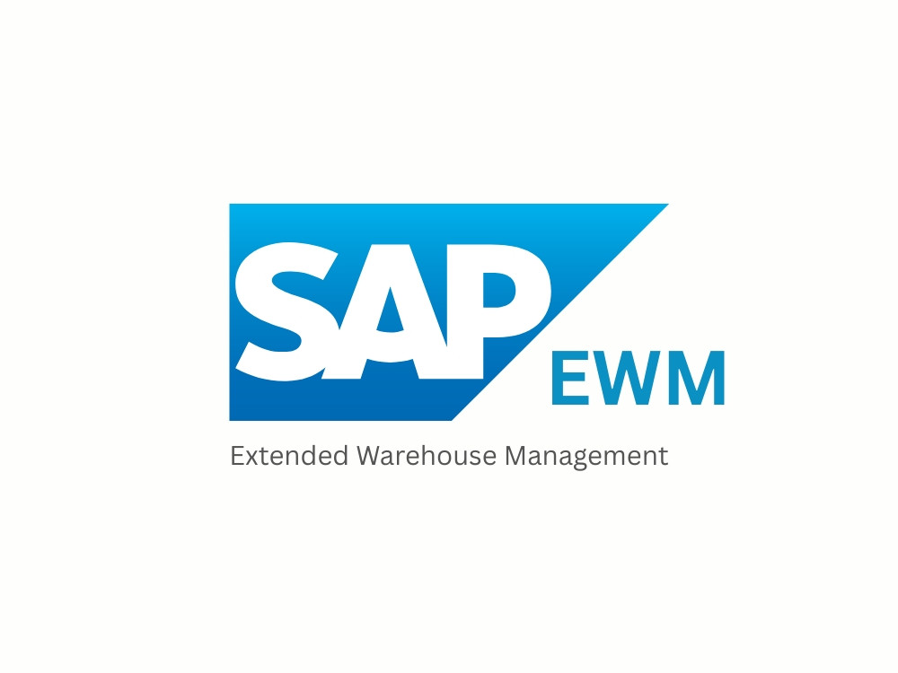</th>
<th></th>
<th></th>
<th></th>
</tr>
<tr class="header">
<th rowspan="2"><mark>Perfil</mark></th>
<th><mark>Overview</mark></th>
<th><mark>Sistema empresarial avanzado para gestión de almacenes, inventarios, picking, packing y despacho.</mark></th>
<th><mark>Plataforma para gestión logística e inventarios en entornos empresariales.</mark></th>
<th><mark>Empresa enfocada en supply chain con IA predictiva y automatización logística.</mark></th>
<th><mark>Sistema low-code especializado en optimización del armado de rollys</mark> contenedores <mark>para despacho a tiendas.</mark></th>
</tr>
<tr class="odd">
<th><mark>Ventaja competitiva ¿Qué valor ofrece a los clientes?</mark></th>
<th><mark>Ofrece integración total con procesos corporativos, alta escalabilidad y trazabilidad logística completa.</mark></th>
<th><mark>Alta seguridad, integración cloud y respaldo corporativo.</mark></th>
<th><mark>Uso de inteligencia artificial avanzada para planificación logística.</mark></th>
<th><mark>Resuelve un problema puntual de alto impacto con rápida implementación y menor costo.</mark></th>
</tr>
<tr class="header">
<th rowspan="2"><mark>Perfil de Marketing</mark></th>
<th><mark>Mercado objetivo</mark></th>
<th><mark>Grandes corporaciones, retail masivo, cadenas internacionales.</mark></th>
<th><mark>Empresas medianas y grandes.</mark></th>
<th><mark>Retail grande, manufactura, cadenas internacionales.</mark></th>
<th><mark>Centros de distribución, retail nacional, operadores logísticos.</mark></th>
</tr>
<tr class="odd">
<th><mark>Estrategias de marketing</mark></th>
<th><ul>
<li><blockquote>

<mark>Marca reconocida globalmente</mark>

</blockquote></li>
<li><blockquote>

<mark>Ventas consultivas B2B</mark>

</blockquote></li>
<li><blockquote>

<mark>Soluciones integrales ERP</mark>

</blockquote></li>
</ul></th>
<th><ul>
<li><blockquote>

<mark>Posicionamiento corporativo</mark>

</blockquote></li>
<li><blockquote>

<mark>Integración con ecosistema Oracle</mark>

</blockquote></li>
</ul></th>
<th><ul>
<li><blockquote>

<mark>Innovación tecnológica</mark>

</blockquote></li>
<li><blockquote>

<mark>Casos de éxito globales</mark>

</blockquote></li>
</ul></th>
<th><ul>
<li><blockquote>

<mark>Pilotos gratuitos</mark>

</blockquote></li>
<li><blockquote>

<mark>Venta consultiva B2B</mark>

</blockquote></li>
<li><blockquote>

<mark>Casos de ahorro operativo</mark>

</blockquote></li>
</ul></th>
</tr>
<tr class="header">
<th rowspan="3"><mark>Perfil de Producto</mark></th>
<th><mark>Productos &amp; Servicios</mark></th>
<th><mark>WMS, inventarios, supply chain, transporte, analítica.</mark></th>
<th><mark>Warehouse management, cloud logistics, analytics.</mark></th>
<th><mark>Forecasting, warehouse, transportation, AI analytics.</mark></th>
<th><mark>Optimización de rollys</mark> contenedores<mark>, dashboard operativo, instrucciones visuales.</mark></th>
</tr>
<tr class="odd">
<th><mark>Precios &amp; Costos</mark></th>
<th><mark>Altos costos de licencia, implementación y mantenimiento.</mark></th>
<th><mark>Licencias empresariales elevadas.</mark></th>
<th><mark>Altos costos empresariales.</mark></th>
<th><mark>Suscripción SaaS accesible / implementación modular.</mark></th>
</tr>
<tr class="header">
<th><mark>Canales de distribución (Web y/o Móvil)</mark></th>
<th><mark>Web empresarial / plataformas corporativas.</mark></th>
<th><mark>Web / Cloud empresarial.</mark></th>
<th><mark>Web / SaaS empresarial.</mark></th>
<th><mark>Web / Tablet / dispositivos móviles.</mark></th>
</tr>
<tr class="odd">
<th rowspan="4"><mark>Análisis SWOT</mark></th>
<th><mark>Fortalezas</mark></th>
<th><ul>
<li><blockquote>

<mark>Prestigio global</mark>

</blockquote></li>
<li><blockquote>

<mark>Solución robusta</mark>

</blockquote></li>
<li><blockquote>

<mark>Integración total</mark>

</blockquote></li>
</ul></th>
<th><ul>
<li><blockquote>

<mark>Infraestructura sólida</mark>

</blockquote></li>
<li><blockquote>

<mark>Marca fuerte</mark>

</blockquote></li>
</ul></th>
<th><ul>
<li><blockquote>

<mark>IA avanzada</mark>

</blockquote></li>
<li><blockquote>

<mark>Innovación reconocida</mark>

</blockquote></li>
</ul></th>
<th><ul>
<li><blockquote>

<mark>Especialización</mark>

</blockquote></li>
<li><blockquote>

<mark>Bajo costo</mark>

</blockquote></li>
<li><blockquote>

<mark>Fácil adopción</mark>

</blockquote></li>
</ul></th>
</tr>
<tr class="header">
<th><mark>Debilidades</mark></th>
<th><ul>
<li><blockquote>

<mark>Costoso</mark>

</blockquote></li>
<li><blockquote>

<mark>Implementación compleja</mark>

</blockquote></li>
</ul></th>
<th><ul>
<li><blockquote>

<mark>Costoso</mark>

</blockquote></li>
<li><blockquote>

<mark>Complejo para pymes</mark>

</blockquote></li>
</ul></th>
<th><ul>
<li><blockquote>

<mark>Complejidad alta</mark>

</blockquote></li>
<li><blockquote>

<mark>Costoso</mark>

</blockquote></li>
</ul></th>
<th><ul>
<li><blockquote>

<mark>Marca nueva</mark>

</blockquote></li>
<li><blockquote>

<mark>Startup en crecimiento</mark>

</blockquote></li>
</ul></th>
</tr>
<tr class="odd">
<th><mark>Oportunidades</mark></th>
<th><mark>Digitalización empresarial</mark></th>
<th><mark>Expansión cloud</mark></th>
<th><mark>Automatización creciente</mark></th>
<th><ul>
<li><blockquote>

<mark>Retail peruano en expansión</mark>

</blockquote></li>
<li><blockquote>

<mark>Transformación digital logística</mark>

</blockquote></li>
</ul></th>
</tr>
<tr class="header">
<th><mark>Amenazas</mark></th>
<th><mark>Startups ágiles especializadas</mark></th>
<th><mark>Soluciones nicho low-cost</mark></th>
<th><mark>Soluciones especializadas más simples</mark></th>
<th><mark>Grandes ERPs consolidados</mark></th>
</tr>
</thead>
<tbody>
</tbody>
</table>

### 2.1.2. Estrategias y tácticas frente a competidores

**Estrategias Competitivas**

1.  **Especialización de nicho**

> Mientras los competidores ofrecen suites logísticas generales, RollySmart se enfocará exclusivamente en el armado inteligente de rollys contenedores, resolviendo una necesidad específica no atendida directamente.

2.  **Menor costo total**

> Se ofrecerá una solución más económica que los sistemas corporativos tradicionales, reduciendo barreras de entrada para empresas medianas.

3.  **Implementación rápida**

> Gracias al enfoque low-code, la implementación será más ágil que competidores de gran escala.

4.  **Experiencia operativa simple**

> Diseño centrado en operarios, con interfaz intuitiva y mínima curva de aprendizaje.

**Tácticas Competitivas**

### Comerciales

- Pilotos gratuitos de validación

- Modelo SaaS mensual escalable

- Demostraciones con métricas de ahorro

### Marketing

- Campañas dirigidas a jefes logísticos

- Casos de éxito locales

- Presencia en ferias supply chain

### Producto

- Dashboard con KPIs logísticos

- Integración futura con ERP/WMS

- Mejora continua basada en feedback

### Servicio

- Capacitación rápida al personal

- Soporte postventa cercano

- Atención personalizada

## 2.2 Entrevistas

### 2.2.1. Diseño de entrevistas

**Segmento Objetivo 1:** Operarios de Armado y Despacho en CD

**Perfil:** Usuarios que realizan o supervisan el trabajo físico en el centro de distribución.

**Enfoque:** Operatividad diaria, frustraciones, toma de decisiones en el armado.

**Preguntas:**

1.  ¿Cómo es tu proceso al preparar pedidos para despacho?

2.  ¿Cómo decides el orden en el que colocas los productos en el rolly?

3.  ¿Qué factores tomas en cuenta al apilar la mercadería?

4.  ¿Qué problemas suelen aparecer durante el armado de los rollys?

5.  ¿Qué situaciones generan más errores o daños en la mercadería?

6.  ¿Qué tan frecuente es que haya problemas en el armado de pedidos?

7.  ¿Cómo te sientes al usar herramientas digitales en tu trabajo y qué tan útiles te resultan?

**Segmento Objetivo 2:** Gerentes de Operaciones Logísticas en Retail/Distribución

**Perfil:** Tomadores de decisiones, enfocados en costos, eficiencia y control. Enfoque: Rentabilidad, KPIs, gestión de flotas y problemas a nivel macro.

**Guía de preguntas:**

1.  ¿Cómo evalúa actualmente el desempeño del proceso de despacho?

2.  ¿Qué indicadores o criterios usa para medir la eficiencia del proceso?

3.  ¿Qué impacto tienen los errores en el armado sobre los costos o la operación?

4.  ¿Qué herramientas o sistemas utilizan actualmente para este proceso?

5.  ¿Qué problemas suelen reportar las tiendas al recibir la mercadería?

6.  ¿Cuáles son las principales dificultades que enfrenta en la operación diaria de despacho?

7.  ¿Qué características considera importantes en una herramienta para mejorar este proceso?

### 2.2.2. Registro de entrevistas

**Segmento Objetivo 1:** Operarios de Armado y Despacho en CD

<u>Entrevista N 1:</u>

Entrevistador: Andre Valverde Mozo

Entrevistado: Manuela Giraldo

Segmento objetivo: Operarios de Armado y Despacho en CD

Link de la entrevista: [<u>ENTREVISTA 1</u>](https://upcedupe-my.sharepoint.com/:v:/g/personal/u202218899_upc_edu_pe/IQABIYZ_1ZDsT5usxGVP6dvhAU8bmxQoKpqSexM0ViEE0ks?nav=eyJyZWZlcnJhbEluZm8iOnsicmVmZXJyYWxBcHAiOiJTdHJlYW1XZWJBcHAiLCJyZWZlcnJhbFZpZXciOiJTaGFyZURpYWxvZy1MaW5rIiwicmVmZXJyYWxBcHBQbGF0Zm9ybSI6IldlYiIsInJlZmVycmFsTW9kZSI6InZpZXcifX0%3D&e=ypfIV2)

Resumen:

Manuela es una trabajadora pragmática y experimentada que opera principalmente en base a criterio propio, ya que no existen procesos estandarizados para el armado de rollys. La presión por cumplir tiempos es su mayor frustración, lo que la lleva a tomar atajos que derivan en errores como mercadería mal apilada o pedidos incompletos. Estos problemas no son ocasionales, sino parte de su día a día, agravándose en fechas de alto volumen. Además, identifica la hoja de picking como un punto crítico, ya que cuando tiene errores o hay faltantes en almacén, todo el flujo se detiene. Frente a la tecnología se muestra escéptica por experiencias previas negativas, pero está dispuesta a adoptar una herramienta si es simple, rápida y que realmente le resuelva el trabajo, no que se lo complique.

<u>Entrevista N 2:</u>

Entrevistador: David Alexander Perez Garcia

Entrevistado: Tony Rodriguez Gonzales

Segmento objetivo: Operarios de Armado y Despacho en CD

Link de la entrevista: [<u>ENTREVISTA 2</u>](https://upcedupe-my.sharepoint.com/:v:/g/personal/u202222942_upc_edu_pe/IQAIME-uVLeWTo9Bl2nE4xF8AaNqDB4cpqJvYUEUckDnZnQ?nav=eyJyZWZlcnJhbEluZm8iOnsicmVmZXJyYWxBcHAiOiJPbmVEcml2ZUZvckJ1c2luZXNzIiwicmVmZXJyYWxBcHBQbGF0Zm9ybSI6IldlYiIsInJlZmVycmFsTW9kZSI6InZpZXciLCJyZWZlcnJhbFZpZXciOiJNeUZpbGVzTGlua0NvcHkifX0&e=a6zkHS)

Resumen:

El entrevistado es un operario de armado y despacho en un centro de distribución, aunque no se especifican sus nombres, apellidos, edad ni distrito. Su labor consiste en recibir listas de pedidos, recolectar productos del almacén y organizarlos en rollys, verificando al final que todo esté completo antes del despacho. Para ordenar la mercadería, coloca los productos más pesados en la parte inferior y los más frágiles arriba, además de agruparlos por tipo o destino para facilitar la descarga. Al apilar, toma en cuenta factores como peso, tamaño, fragilidad y estabilidad, buscando aprovechar el espacio de manera eficiente. Entre los principales problemas que enfrenta se encuentran faltantes, productos mal ubicados, poco tiempo y, en ocasiones, falta de rollys, siendo frecuentes los errores pequeños en el día a día. Estos errores suelen generarse por el apuro, una mala distribución del peso o un embalaje inadecuado. En cuanto al uso de herramientas digitales, considera que son útiles si son simples y rápidas, pero pueden dificultar el trabajo si son complejas, además de que a veces falta capacitación para utilizarlas correctamente.

<u>Entrevista N 3:</u>

Entrevistador: Karito Medina

Entrevistado: Alexandr Chocce

Segmento objetivo: Operarios de Armado y Despacho en CD

Link de la entrevista: [<u>ENTREVISTA 3</u>](https://upcedupe-my.sharepoint.com/:v:/g/personal/u202218899_upc_edu_pe/IQABIYZ_1ZDsT5usxGVP6dvhAU8bmxQoKpqSexM0ViEE0ks?nav=eyJyZWZlcnJhbEluZm8iOnsicmVmZXJyYWxBcHAiOiJTdHJlYW1XZWJBcHAiLCJyZWZlcnJhbFZpZXciOiJTaGFyZURpYWxvZy1MaW5rIiwicmVmZXJyYWxBcHBQbGF0Zm9ybSI6IldlYiIsInJlZmVycmFsTW9kZSI6InZpZXcifX0%3D&e=ypfIV2)

Resumen:

La entrevista permitió identificar que el proceso de preparación de pedidos para despacho se realiza principalmente de manera manual, basándose en la experiencia del operario para organizar los productos dentro del rolly. Las decisiones de carga suelen considerar factores como peso, tamaño, fragilidad y facilidad de descarga en tienda.

Entre los principales problemas detectados se encuentran la falta de espacio, cambios de último momento en los pedidos, cajas en mal estado y presión por tiempos de despacho, lo que incrementa el riesgo de errores y daños en la mercadería. Asimismo, se evidenció que los inconvenientes menores ocurren con frecuencia semanal, especialmente en temporadas de alta demanda.

Respecto al uso de herramientas digitales, el usuario mostró una percepción positiva siempre que estas sean rápidas, simples e intuitivas. Se concluye que existe oportunidad para implementar una solución tecnológica que reduzca errores, optimice el armado de rollys y facilite la operación diaria sin generar carga adicional al operario.

**Segmento Objetivo 2:** Gerentes de Operaciones Logísticas en Retail/Distribución

<u>Entrevista N 1:</u>

Entrevistador: Frida Dam Rubianes

Entrevistado: Valentina Rivas

Segmento objetivo: Gerentes de Operaciones Logísticas en Retail/Distribución

Link de la entrevista: [<u>ENTREVISTA 1</u>](https://drive.google.com/file/d/1dHZvWgkyiVK4qW8OKRfrIE9ws9YLhUmy/view?usp=sharing)

Resumen:

Se entrevistó a Valentina Rivas, quien es líder en el área de operaciones. Ella destaca que la falta de herramientas tecnológicas en el proceso de carga genera ineficiencias que afectan la rentabilidad de la empresa. Segun su experiencia, la transición hacia una logística basada en datos es fundamental para eliminar errores manuales y optimizar el uso de los recursos en el centro de distribución

La entrevista con Valentina muestra una brecha entre la gestión moderna de inventarios y los procesos de carga antiguos, se evidencia una falta de datos precisos sobre el uso del espacio, lo cual genera gastos innecesarios en transporte y daños de los productos. Se concluye que el proyecto debe enfocarse en una herramienta digital que estandarice el armado de los rollys y entregue información en tiempo real para mejorar la rentabilidad.

<u>Entrevista N 2:</u>

Entrevistador: Frida Dam Rubianes

Entrevistado: Marco Linares

Segmento objetivo: Gerentes de Operaciones Logísticas en Retail/Distribución

Link de la entrevista: [<u>ENTREVISTA 2</u>](https://drive.google.com/file/d/1OBWvIZm--d_eOhkyf80slONAwTJDjS8g/view?usp=sharing)

Resumen:

Durante la entrevista, Marco Linares, Gerente de Operaciones, comentó los principales problemas del proceso actual de armado y despacho de mercadería. Explicó que la evaluación del trabajo se realiza de manera reactiva, ya que depende de reportes manuales elaborados una vez al mes, lo que dificulta detectar errores y corregirlos oportunamente. Además, mencionó que, pese a contar con sistemas modernos para el control de inventarios, la forma en que se acomodan las cajas dentro de los contenedores queda totalmente a criterio del operario y su experiencia. Esta forma de trabajo genera dos dificultades frecuentes: el desplazamiento de camiones con espacio sin utilizar, lo que implica costos de transporte innecesarios, y las constantes quejas de las tiendas por productos dañados o aplastados debido a una inadecuada distribución del peso y de las categorías.

En la entrevista se evidenció que se necesita digitalizar y estandarizar la carga para dejar de perder dinero en logística. Para bajar los costos de transporte y evitar que la mercadería se dañe, el proceso ya no puede depender de lo que cada trabajador decida en el momento. Por ello, es clave implementar una herramienta tecnológica que haga dos cosas: guiar al operario a través de una pantalla para que aproveche bien el espacio, y darle a la gerencia los datos en tiempo real. Así, se dejará de tomar decisiones con información atrasada y se podrá actuar rápido para cuidar las ganancias de la empresa.

<u>Entrevista N 3:</u>

Entrevistador: Andre Valverde Mozo

Entrevistado: Luis Quispe

Segmento objetivo: Gerentes de Operaciones Logísticas en Retail/Distribución

Link de la entrevista: [<u>ENTREVISTA 3</u>](https://upcedupe-my.sharepoint.com/:v:/g/personal/u202218899_upc_edu_pe/IQDcK_fFls_4TZ2SmIMy8rOzAXfSqblgLCsEzDXJGJZU3BA?nav=eyJyZWZlcnJhbEluZm8iOnsicmVmZXJyYWxBcHAiOiJPbmVEcml2ZUZvckJ1c2luZXNzIiwicmVmZXJyYWxBcHBQbGF0Zm9ybSI6IldlYiIsInJlZmVycmFsTW9kZSI6InZpZXciLCJyZWZlcnJhbFZpZXciOiJNeUZpbGVzTGlua0NvcHkifX0&e=3Ewnkc)

Resumen:

Luis es un gerente con visión clara de los problemas operativos pero con herramientas insuficientes para atacarlos. Si bien maneja indicadores como el fill rate y el tiempo de armado, reconoce que su medición es manual y reactiva, lo que le impide tomar decisiones a tiempo. Los errores en el armado tienen para él un impacto directo en costos, desde reenvíos hasta quiebres de stock en tienda, y el proceso actual depende casi completamente del criterio del operario, sin ninguna herramienta que lo guíe o estandarice. La rotación de personal agrava esto, ya que cada nuevo ingreso representa una pérdida de productividad. Frente a una solución tecnológica, su prioridad es clara: que sea fácil de implementar, que oriente al operario en tiempo real y que le brinde visibilidad gerencial del proceso sin depender de reportes manuales.

### 2.2.3. Análisis de entrevistas

Se realizaron entrevistas a dos segmentos clave: operarios de armado y despacho, y gerentes o líderes de operaciones logísticas. Ambos grupos coinciden en señalar los mismos problemas desde perspectivas distintas, lo que valida con fuerza la necesidad de una solución como RollySmart.

**Hallazgos principales**

- El hallazgo más transversal en ambos segmentos es la ausencia total de estandarización en el proceso de armado. Los operarios toman decisiones en base a experiencia e intuición, sin ninguna guía que los oriente, lo que genera inconsistencias que se repiten día a día.

- Desde el lado operativo, los operarios enfrentan presión constante de tiempo, faltantes de productos, cajas en mal estado y cambios de último momento en los pedidos. Esta combinación los lleva a tomar atajos que derivan en mercadería mal apilada, pedidos incompletos y daños en los productos. Los errores menores son cotidianos y en temporadas de alta demanda la situación se desborda.

- Desde el lado gerencial, el problema se traduce directamente en costos concretos: reenvíos, quiebres de stock en tienda, camiones con espacio desaprovechado y reclamos frecuentes por productos dañados o faltantes.

- La medición del proceso es reactiva y manual, lo que impide a los gerentes actuar a tiempo. La rotación de personal agrava aún más la situación, ya que cada nuevo operario reinicia el ciclo de aprendizaje desde cero.

- Frente a la tecnología, ambos segmentos coinciden en sus condiciones: los operarios la aceptan si es simple, rápida e intuitiva; los gerentes la exigen fácil de implementar y que brinde visibilidad en tiempo real sin reemplazar toda la infraestructura existente.

**Conclusión**

- Las entrevistas confirman que existe un problema real, frecuente y costoso en el proceso de armado de rollys, y que ninguna de las empresas consultadas cuenta actualmente con una herramienta que lo resuelva.

- RollySmart tiene una oportunidad clara de mercado si logra combinar dos cosas: guiar al operario en tiempo real durante el armado y entregar datos accionables a la gerencia.

- El éxito de la adopción dependerá de que la solución sea simple de implementar y sin fricciones para quienes la usan en el día a día, condición que ambos segmentos exigen por igual.

## 2.3 Needfinding

### 2.3.1 User Personas

Para la realización de las fichas de User Personas se han considerado los 2 segmentos objetivos: “Operarios de Armado y Despacho en CD” y “Gerentes de Operaciones Logísticas en Retail/Distribución”. Se elaborarán las fichas con la información recopilada de las entrevistas sobre su perfil.

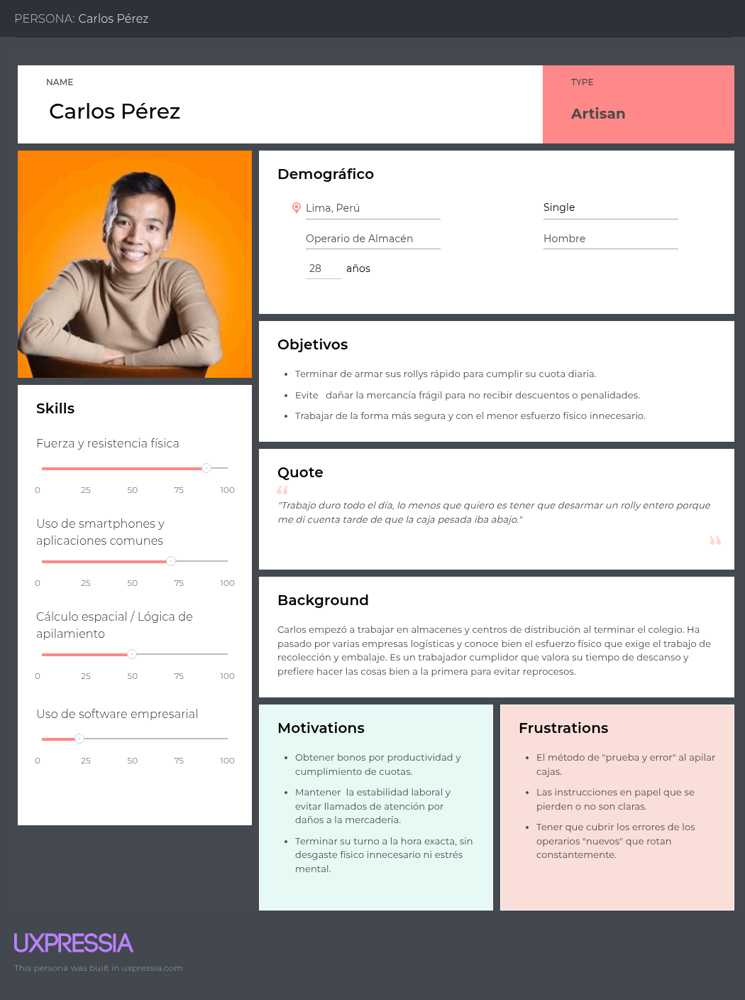

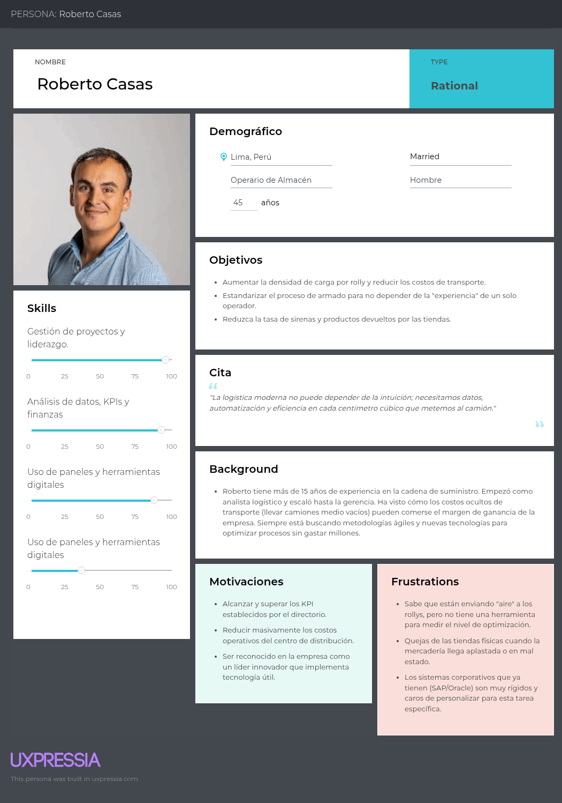

### 2.3.2 User Task Matrix

El User Task Matrix es una herramienta que cruza las tareas de los usuarios con variables como frecuencia, relevancia o dificultad. Permite identificar las funciones más importantes y priorizarlas en el diseño, facilitando la comprensión de las necesidades del usuario y mejorando su experiencia.

| **Task Matrix**                       | **Carlos (Operario)** |             | **Roberto (Gerente)** |             |
|---------------------------------------|-----------------------|-------------|-----------------------|-------------|
|                                       | Frecuencia            | Importancia | Frecuencia            | Importancia |
| **Iniciar sesión en la plataforma**   | Alta (Diaria)         | Alta        | Alta                  | Alta        |
| **Escanear/Seleccionar orden**        | Alta                  | Alta        | Nula                  | Baja        |
| **Ver guía paso a paso de armado**    | Alta                  | Alta        | Nula                  | Nula        |
| **Reportar producto dañado/faltante** | Media                 | Alta        | Baja                  | Media       |
| **Visualizar Dashboard de KPIs**      | Nula                  | Nula        | Alta                  | Alta        |
| **Configurar reglas de apilamiento**  | Nula                  | Nula        | Baja                  | Alta        |
| **Exportar reportes de eficiencia**   | Nula                  | Nula        | Media                 | Alta        |

### 2.3.3 Empathy Maps

En esta sección, se desarrollaron los Empathy Maps de cada segmento objetivo.

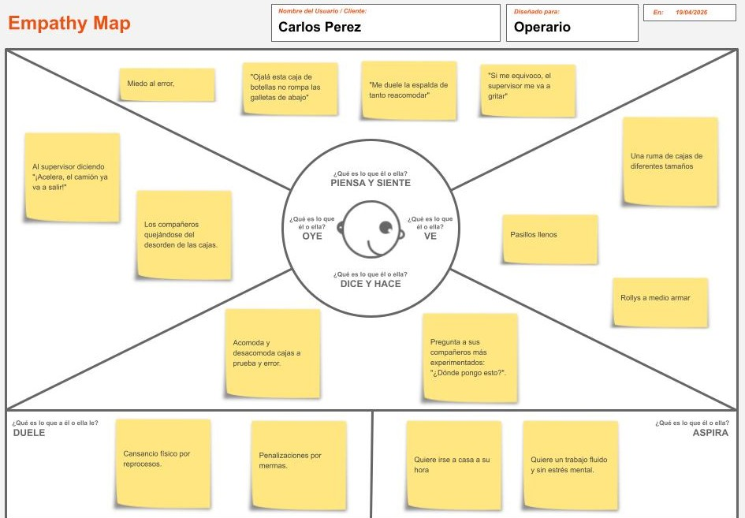

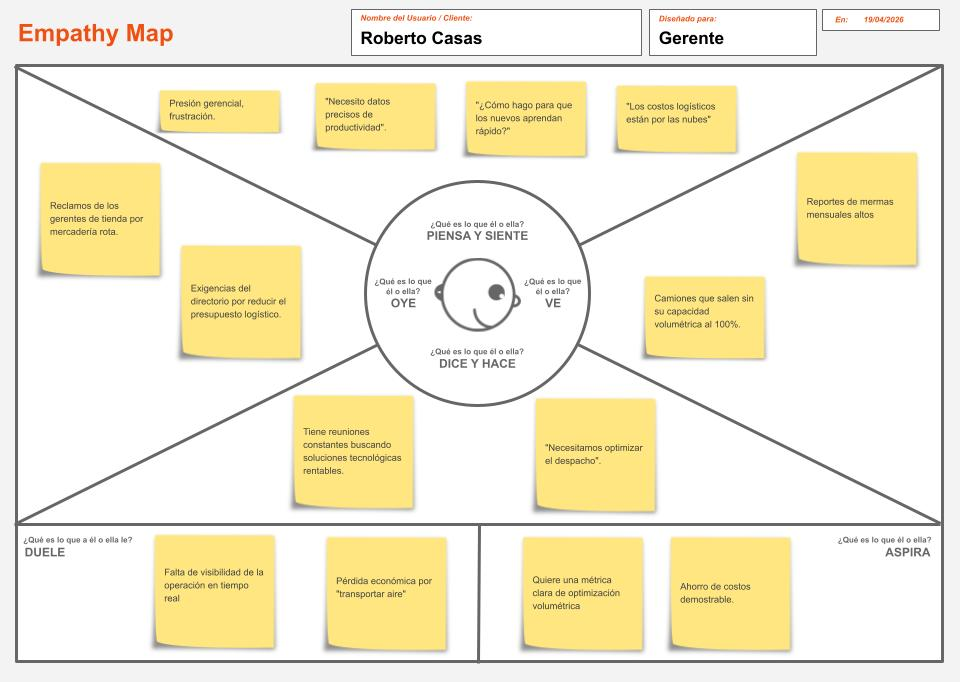

### 2.3.4 As-is Scenario Mapping

**Segmento Objetivo 1: Carlos (Operario)**

**Escenario: Preparar un pedido grande para la tienda de San Isidro usando métodos manuales.**

| **Phases**   | **1. Recibir Orden**                                | **2. Recolección (Picking)**                                   | **3. Armado del Rolly Contenedor (Packing)**                                                 | **4. Despacho**                                   |
|--------------|-----------------------------------------------------|----------------------------------------------------------------|----------------------------------------------------------------------------------------------|---------------------------------------------------|
| **Doing**    | Recibe hoja impresa con lista de productos.         | Va por los pasillos trayendo los productos a la zona de carga. | Empieza a apilar. Se da cuenta de que puso algo frágil abajo. Saca todo y vuelve a meterlo.  | Cierra el rolly contenedor y lo empuja al camión. |
| **Thinking** | "Son muchos ítems diferentes, va a ser complicado". | "¿Dónde dejé el rolly contenedor vacío?"                       | "No me entra esta última caja, tendré que usar otro rolly contenedor entero solo para esto". | "Por fin terminé, pero me demoré mucho".          |
| **Feeling**  | Neutral / Rutina                                    | Apurado                                                        | Frustrado / Estresado                                                                        | Aliviado, pero cansado                            |

**Segmento Objetivo 2: Roberto (Gerente)**

**Escenario: Analizar los sobrecostos de transporte y daños de mercadería del mes anterior.**

| **Phases**   | **1. Recibir Reporte Mensual**                            | **2. Identificar el Problema**                                       | **3. Indagar Causas**                                               | **4. Tomar Acción "A Ciegas"**                          |
|--------------|-----------------------------------------------------------|----------------------------------------------------------------------|---------------------------------------------------------------------|---------------------------------------------------------|
| **Doing**    | Lee el reporte financiero enviado por el área de control. | Cruza datos en Excel: más camiones usados de lo presupuestado.       | Llama a los supervisores del almacén para preguntar qué pasó.       | Envía un correo pidiendo "más cuidado" a los operarios. |
| **Thinking** | "Otra vez los costos logísticos están sobregirados".      | "¿Por qué enviamos tantos camiones si las ventas no subieron tanto?" | "Nadie me da una respuesta clara. Dicen que las cajas no cuadraba". | "Esto no soluciona nada, el próximo mes pasará igual".  |
| **Feeling**  | Preocupado                                                | Confundido                                                           | Frustrado                                                           | Resignado                                               |

# Capítulo III: Requirements Specification

## 3.1 To-Be Scenario Mapping

**Segmento Objetivo 2:Carlos (Operario)**

**Escenario: Preparar un pedido grande para la tienda de San Isidro usando RollySmart.**

| **Phases**   | **1. Recibir Orden Digital**                                             | **2. Recolección**                                                                        | **3. Armado Asistido (RollySmart)**                                                                  | **4. Despacho Optimizado**                                         |
|--------------|--------------------------------------------------------------------------|-------------------------------------------------------------------------------------------|------------------------------------------------------------------------------------------------------|--------------------------------------------------------------------|
|              |                                                                          |                                                                                           |                                                                                                      |                                                                    |
| **Doing**    | Escanea su código en la tablet y aparece la orden.                       | Lleva los productos a la zona. RollySmart ya le indica cuántos rollys contenedores usará. | Mira la pantalla, el sistema le dice: "Caja pesada 1 a la base". Carlos lo pone y pulsa "Siguiente". | Finaliza la orden en la tablet. El sistema notifica al supervisor. |
| **Thinking** | "Qué bien, ya sé que voy a necesitar exactamente 2 rollys contenedores". | "Ya tengo todo listo para empezar".                                                       | "Es como seguir las instrucciones de un Lego. Es muy fácil y rápido".                                | "Terminé antes de tiempo, mi cuota está cubierta".                 |
| **Feeling**  | Organizado                                                               | Seguro                                                                                    | Confiado                                                                                             | Productivo                                                         |

**Segmento Objetivo 2:**

**Escenario: Monitorear la eficiencia del despacho y el uso de la flota en tiempo real.**

| **Phases**   | **1. Monitoreo en Tiempo Real**                                                   | **2. Análisis de Optimización**                                       | **3. Ajuste de Reglas**                                             | **4. Reporte Ejecutivo**                                      |
|--------------|-----------------------------------------------------------------------------------|-----------------------------------------------------------------------|---------------------------------------------------------------------|---------------------------------------------------------------|
| **Doing**    | Abre el Dashboard de RollySmart desde su laptop.                                  | Revisa la métrica "Tasa de llenado volumétrico por rolly contenedor". | Modifica una regla de compatibilidad para juntar ciertos productos. | Exporta PDF del ahorro generado en fletes para el directorio. |
| **Thinking** | "Puedo ver exactamente cuántos rollys contenedores se están armando ahora mismo". | "Excelente, el nivel de llenado subió al 92% promedio".               | "Con este cambio, ahorraremos un rolly contenedor más por pedido".  | "Tengo datos duros para demostrar la rentabilidad del área".  |
| **Feeling**  | En control                                                                        | Satisfecho                                                            | Estratégico                                                         | Orgulloso                                                     |

## 

## 3.2 User Stories

Se identificaron las siguientes épicas que se componen de las historias de usuario.

| **Epic ID** | **Epic**                                                                                                                                                                                                                                                                             | **User Story ID** | **User Stories**                                                |
|-------------|--------------------------------------------------------------------------------------------------------------------------------------------------------------------------------------------------------------------------------------------------------------------------------------|-------------------|-----------------------------------------------------------------|
| E01         | **Como Operario de Armado y Despacho en CD, quiero recibir y visualizar mis órdenes de pedido digitalmente, para comenzar el proceso de armado sin depender de hojas impresas.**                                                                                                     | US01              | Visualización de lista de órdenes pendientes                    |
|             |                                                                                                                                                                                                                                                                                      | US02              | Visualización de detalle de una orden |
|             |                                                                                                                                                                                                                                                                                      | US03              | Historial de órdenes procesadas       |
| E02         | **Como Operario de Armado y Despacho en CD, quiero que el sistema me guíe paso a paso en la distribución de productos y me permita confirmar el armado completado desde mi dispositivo, para armar pedidos correctamente y notificar al gerente cuando estén listos para despacho.** | US04              | Visualización de rollys contenedores necesarios para el pedido  |
|             |                                                                                                                                                                                                                                                                                      | US05              | Generación de plan de armado                                    |
|             |                                                                                                                                                                                                                                                                                      | US06              | Visualización de instrucciones de apilamiento por paso          |
|             |                                                                                                                                                                                                                                                                                      | US07              | Finalización y registro de pedido armado                        |
| E03         | **Como Gerente de Operaciones Logísticas, quiero visualizar el estado del despacho en tiempo real y generar reportes exportables de rendimiento, para tomar decisiones informadas y demostrar el impacto económico de la operación ante la dirección.**                              | US08              | Visualización de dashboard de despacho en tiempo real           |
|             |                                                                                                                                                                                                                                                                                      | US09              | Visualización de métricas de eficiencia operativa               |
|             |                                                                                                                                                                                                                                                                                      | US10              | Descarga de reporte de rendimiento en PDF                       |
| E04         | **Como Gerente de Operaciones Logísticas, quiero definir y ajustar reglas de compatibilidad, peso y fragilidad, para que la IA adapte sus recomendaciones a las necesidades específicas de mi operación.**                                                                           | US11              | Registro de regla de compatibilidad entre productos             |
|             |                                                                                                                                                                                                                                                                                      | US12              | Modificación de regla de compatibilidad                         |
|             |                                                                                                                                                                                                                                                                                      | US13              | Registro de parámetros de peso y fragilidad                     |
|             |                                                                                                                                                                                                                                                                                      | US14              | Modificación de parámetros de peso y fragilidad                 |

<table style="width:100%;">
<colgroup>
<col style="width: 8%" />
<col style="width: 17%" />
<col style="width: 26%" />
<col style="width: 32%" />
<col style="width: 14%" />
</colgroup>
<thead>
<tr class="header">
<th><strong><mark>UserStory ID</mark></strong></th>
<th><strong><mark>Título</mark></strong></th>
<th><strong><mark>Descripción</mark></strong></th>
<th><strong><mark>Criterios de Aceptación</mark></strong></th>
<th><strong><mark>Relacionado con (Epic ID)</mark></strong></th>
</tr>
<tr class="odd">
<th>US01</th>
<th>Visualización de lista de órdenes pendientes</th>
<th><mark>Como Operario de Armado y Despacho en CD, quiero ver la lista de órdenes pendientes asignadas a mí, para saber qué pedidos debo preparar durante mi jornada.</mark></th>
<th>
<strong><mark>Scenario 1: Operario visualiza sus órdenes pendientes</mark></strong>

<mark><strong>Given</strong> que el operario ha iniciado sesión en su dispositivo</mark>

<mark><strong>When</strong> accede a la sección de órdenes</mark>

<mark><strong>Then</strong> el sistema muestra la lista de órdenes pendientes asignadas a él con su información básica</mark>

<strong><mark>Scenario 2: No hay órdenes pendientes</mark></strong>

<mark><strong>Given</strong> que el operario ha iniciado sesión en su dispositivo</mark>

<mark><strong>When</strong> accede a la sección de órdenes y no tiene ninguna asignada</mark>

<mark><strong>Then</strong> el sistema muestra un mensaje indicando que no hay órdenes pendientes</mark>
</th>
<th><mark>E01</mark></th>
</tr>
<tr class="header">
<th>US02</th>
<th><mark>Visualización de detalle de una orden</mark></th>
<th><mark>Como Operario de Armado y Despacho en CD, quiero ver el detalle de productos de una orden seleccionada, para conocer qué ítems debo preparar antes de iniciar el armado.</mark></th>
<th>
<strong><mark>Scenario 1: Operario consulta el detalle de una orden</mark></strong>

<mark><strong>Given</strong> que el operario está en la lista de órdenes pendientes</mark>

<mark><strong>When</strong> selecciona una orden específica</mark>

<mark><strong>Then</strong> el sistema muestra el detalle completo con la lista de productos, cantidades y características</mark>

<strong><mark>Scenario 2: Orden con múltiples tipos de productos</mark></strong>

<mark><strong>Given</strong> que el operario ha seleccionado una orden</mark>

<mark><strong>When</strong> visualiza el detalle</mark>

<mark><strong>Then</strong> el sistema muestra cada producto diferenciado con su nombre, cantidad, peso y nivel de fragilidad</mark>
</th>
<th><mark>E01</mark></th>
</tr>
<tr class="odd">
<th>US03</th>
<th><mark>Historial de órdenes procesadas</mark></th>
<th><mark>Como Operario de Armado y Despacho en CD, quiero acceder al historial de órdenes que ya procesé, para consultar pedidos anteriores en caso de dudas o revisiones.</mark></th>
<th>
<strong><mark>Scenario 1: Operario consulta su historial</mark></strong>

<mark><strong>Given</strong> que el operario ha iniciado sesión en su dispositivo</mark>

<mark><strong>When</strong> accede a la sección de historial</mark>

<mark><strong>Then</strong> el sistema muestra las órdenes procesadas anteriormente ordenadas por fecha</mark>

<strong><mark>Scenario 2: Operario consulta el detalle de una orden pasada</mark></strong>

<mark><strong>Given</strong> que el operario está en la sección de historial</mark>

<mark><strong>When</strong> selecciona una orden procesada anteriormente</mark>

<mark><strong>Then</strong> el sistema muestra el detalle completo de esa orden incluyendo fecha y productos armados</mark>
</th>
<th><mark>E01</mark></th>
</tr>
<tr class="header">
<th>US04</th>
<th>Visualización de rollys contenedores necesarios para el pedido</th>
<th><mark>Como Operario de Armado y Despacho en CD, quiero ver cuántos rollys</mark> contenedores <mark>necesitaré antes de iniciar el armado, para prepararlos con anticipación y no interrumpir el proceso.</mark></th>
<th>
<strong><mark>Scenario 1: Sistema calcula y muestra los rollys necesarios</mark></strong>

<mark><strong>Given</strong> que el operario ha seleccionado una orden y visualiza su detalle</mark>

<mark><strong>When</strong> el sistema procesa la información de los productos</mark>

<mark><strong>Then</strong> muestra el número exacto de rollys necesarios para completar ese pedido</mark>

<strong><mark>Scenario 2: Pedido que requiere un solo rolly</mark></strong>

<mark><strong>Given</strong> que el operario ha seleccionado una orden con pocos productos</mark>

<mark><strong>When</strong> el sistema procesa la información</mark>

<mark><strong>Then</strong> muestra que solo se necesita un rolly e indica que el pedido es de bajo volumen</mark>
</th>
<th><mark>E02</mark></th>
</tr>
<tr class="odd">
<th>US05</th>
<th>Generación de plan de armado</th>
<th><mark>Como Operario de Armado y Despacho en CD, quiero que al presionar un botón el sistema genere automáticamente el plan de armado considerando las reglas del gerente, para recibir una distribución óptima sin tener que calcularla manualmente.</mark></th>
<th>
<strong><mark>Scenario 1: Generación exitosa del plan de armado</mark></strong>

<mark><strong>Given</strong> que el operario visualiza el número de rollys necesarios</mark>

<mark><strong>When</strong> presiona el botón "Generar armado"</mark>

<mark><strong>Then</strong> la IA genera un plan de distribución óptimo considerando las reglas de compatibilidad, peso y fragilidad configuradas por el gerente</mark>

<strong><mark>Scenario 2: Generación con restricciones de compatibilidad</mark></strong>

<mark><strong>Given</strong> que el gerente ha registrado reglas de compatibilidad entre productos</mark>

<mark><strong>When</strong> el operario presiona "Generar armado" con una orden que contiene productos incompatibles</mark>

<mark><strong>Then</strong> la IA los separa automáticamente en rollys distintos respetando las reglas establecidas</mark>
</th>
<th><mark>E02</mark></th>
</tr>
<tr class="header">
<th>US06</th>
<th>Visualización de instrucciones de apilamiento por paso</th>
<th><mark>Como Operario de Armado y Despacho en CD, quiero ver instrucciones claras paso a paso de cómo apilar cada producto en el rolly</mark> contenedor<mark>, para armar el pedido correctamente sin cometer errores.</mark></th>
<th>
<strong><mark>Scenario 1: Operario sigue las instrucciones paso a paso</mark></strong>

<mark><strong>Given</strong> que el sistema ha generado el plan de armado</mark>

<mark><strong>When</strong> el operario inicia el proceso de apilamiento</mark>

<mark><strong>Then</strong> el sistema muestra una instrucción a la vez indicando qué producto colocar y en qué posición del rolly</mark>

<strong><mark>Scenario 2: Operario avanza al siguiente paso</mark></strong>

<mark><strong>Given</strong> que el operario está siguiendo las instrucciones de apilamiento</mark>

<mark><strong>When</strong> confirma que completó el paso actual</mark>

<mark><strong>Then</strong> el sistema muestra la siguiente instrucción correspondiente</mark>
</th>
<th><mark>E02</mark></th>
</tr>
<tr class="odd">
<th>US07</th>
<th>Finalización y registro de pedido armado</th>
<th><mark>Como Operario de Armado y Despacho en CD, quiero registrar el pedido como completado desde mi dispositivo, para que el gerente quede notificado y el pedido pase a la etapa de despacho.</mark></th>
<th>
<strong><mark>Scenario 1: Operario finaliza el pedido correctamente</mark></strong>

<mark><strong>Given</strong> que el operario ha completado todos los pasos de apilamiento</mark>

<mark><strong>When</strong> presiona el botón de finalizar pedido</mark>

<mark><strong>Then</strong> el sistema registra el pedido como completado y notifica al gerente que está listo para despacho</mark>

<strong><mark>Scenario 2: Intento de finalizar pedido con pasos incompletos</mark></strong>

<mark><strong>Given</strong> que el operario no ha completado todos los pasos de apilamiento</mark>

<mark><strong>When</strong> intenta presionar el botón de finalizar pedido</mark>

<mark><strong>Then</strong> el sistema muestra un aviso indicando que aún quedan pasos pendientes por completar</mark>
</th>
<th><mark>E02</mark></th>
</tr>
<tr class="header">
<th>US08</th>
<th>Visualización de dashboard de despacho en tiempo real</th>
<th><mark>Como Gerente de Operaciones Logísticas, quiero visualizar el estado actual de los pedidos en proceso desde un dashboard, para monitorear la operación sin necesidad de consultar directamente a los operarios.</mark></th>
<th>
<strong><mark>Scenario 1: Gerente accede al dashboard</mark></strong>

<mark><strong>Given</strong> que el gerente ha iniciado sesión en su dispositivo</mark>

<mark><strong>When</strong> accede a la sección de dashboard</mark>

<mark><strong>Then</strong> el sistema muestra el estado actual de todos los pedidos en proceso con su avance en tiempo real</mark>

<strong><mark>Scenario 2: Actualización automática del dashboard</mark></strong>

<mark><strong>Given</strong> que el gerente está visualizando el dashboard</mark>

<mark><strong>When</strong> un operario actualiza el estado de su pedido</mark>

<mark><strong>Then</strong> el dashboard refleja el cambio automáticamente sin necesidad de recargar la página</mark>
</th>
<th><mark>E03</mark></th>
</tr>
<tr class="odd">
<th>US09</th>
<th>Visualización de métricas de eficiencia operativa</th>
<th><mark>Como Gerente de Operaciones Logísticas, quiero ver métricas como tasa de llenado por rolly</mark> contenedor<mark>, número de rollys</mark> contenedores <mark>usados por pedido, tiempo promedio de armado y errores operativos, para evaluar el rendimiento de la operación y detectar oportunidades de mejora.</mark></th>
<th>
<strong><mark>Scenario 1: Gerente visualiza las métricas del día</mark></strong>

<mark><strong>Given</strong> que el gerente está en el dashboard</mark>

<mark><strong>When</strong> accede a la sección de métricas</mark>

<mark><strong>Then</strong> el sistema muestra la tasa de llenado por rolly, número de rollys usados, tiempo promedio de armado y errores operativos del período seleccionado</mark>

<strong><mark>Scenario 2: Gerente filtra métricas por rango de fechas</mark></strong>

<mark><strong>Given</strong> que el gerente está en la sección de métricas</mark>

<mark><strong>When</strong> selecciona un rango de fechas específico</mark>

<mark><strong>Then</strong> el sistema actualiza las métricas mostrando únicamente los datos correspondientes al período seleccionado</mark>
</th>
<th><mark>E03</mark></th>
</tr>
<tr class="header">
<th>US10</th>
<th>Descarga de reporte de rendimiento en PDF</th>
<th><mark>Como Gerente de Operaciones Logísticas, quiero generar y descargar un reporte en PDF con los datos de eficiencia operativa, para presentar resultados ante la dirección y sustentar el impacto económico de la operación.</mark></th>
<th>
<strong><mark>Scenario 1: Gerente descarga el reporte exitosamente</mark></strong>

<mark><strong>Given</strong> que el gerente está visualizando las métricas de eficiencia</mark>

<mark><strong>When</strong> presiona el botón "Descargar reporte"</mark>

<mark><strong>Then</strong> el sistema genera y descarga un PDF con los datos de rendimiento del período seleccionado</mark>

<strong><mark>Scenario 2: Descarga de reporte sin datos disponibles</mark></strong>

<mark><strong>Given</strong> que el gerente intenta descargar un reporte de un período sin operaciones registradas</mark>

<mark><strong>When</strong> presiona el botón "Descargar reporte"</mark>

<mark><strong>Then</strong> el sistema muestra un mensaje indicando que no hay datos disponibles para ese período</mark>
</th>
<th><mark>E03</mark></th>
</tr>
<tr class="odd">
<th>US11</th>
<th>Registro de regla de compatibilidad entre productos</th>
<th><mark>Como Gerente de Operaciones Logísticas, quiero registrar reglas que definan qué productos pueden o no ir juntos en un mismo rolly</mark> contenedor<mark>, para que la IA las considere al generar el plan de armado.</mark></th>
<th>
<strong><mark>Scenario 1: Gerente registra una nueva regla de compatibilidad</mark></strong>

<mark><strong>Given</strong> que el gerente está en la sección de configuración de reglas</mark>

<mark><strong>When</strong> completa el formulario con los productos involucrados y el tipo de restricción y presiona guardar</mark>

<mark><strong>Then</strong> el sistema registra la regla y la IA la considerará en los próximos planes de armado</mark>

<strong><mark>Scenario 2: Intento de registrar una regla duplicada</mark></strong>

<mark><strong>Given</strong> que el gerente intenta registrar una regla de compatibilidad que ya existe</mark>

<mark><strong>When</strong> presiona guardar</mark>

<mark><strong>Then</strong> el sistema muestra un aviso indicando que esa regla ya está registrada</mark>
</th>
<th><mark>E04</mark></th>
</tr>
<tr class="header">
<th>US12</th>
<th>Modificación de regla de compatibilidad</th>
<th><mark>Como Gerente de Operaciones Logísticas, quiero modificar las reglas de compatibilidad existentes, para adaptarlas ante cambios en los productos o necesidades operativas.</mark></th>
<th>
<strong><mark>Scenario 1: Gerente modifica una regla existente</mark></strong>

<mark><strong>Given</strong> que el gerente está en la sección de reglas de compatibilidad</mark>

<mark><strong>When</strong> selecciona una regla existente, realiza los cambios necesarios y guarda</mark>

<mark><strong>Then</strong> el sistema actualiza la regla y la IA aplica los cambios en los siguientes planes de armado</mark>

<strong><mark>Scenario 2: Gerente cancela la modificación</mark></strong>

<mark><strong>Given</strong> que el gerente está editando una regla de compatibilidad</mark>

<mark><strong>When</strong> decide cancelar la edición sin guardar</mark>

<mark><strong>Then</strong> el sistema descarta los cambios y mantiene la regla con sus valores originales</mark>
</th>
<th><mark>E04</mark></th>
</tr>
<tr class="odd">
<th>US13</th>
<th>Registro de parámetros de peso y fragilidad</th>
<th><mark>Como Gerente de Operaciones Logísticas, quiero registrar los parámetros de peso y fragilidad de los productos, para que la IA los tome en cuenta al definir el orden de apilamiento.</mark></th>
<th>
<strong><mark>Scenario 1: Gerente registra parámetros de un producto</mark></strong>

<mark><strong>Given</strong> que el gerente está en la sección de parámetros de productos</mark>

<mark><strong>When</strong> completa el formulario con el nombre del producto, peso y nivel de fragilidad y guarda</mark>

<mark><strong>Then</strong> el sistema registra los parámetros y la IA los considera al generar instrucciones de apilamiento</mark>

<strong><mark>Scenario 2: Intento de registrar un producto ya existente</mark></strong>

<mark><strong>Given</strong> que el gerente intenta registrar parámetros de un producto que ya está en el sistema</mark>

<mark><strong>When</strong> presiona guardar</mark>

<mark><strong>Then</strong> el sistema muestra un aviso indicando que el producto ya existe y sugiere modificarlo</mark>
</th>
<th><mark>E04</mark></th>
</tr>
<tr class="header">
<th>US14</th>
<th>Modificación de parámetros de peso y fragilidad</th>
<th><mark>Como Gerente de Operaciones Logísticas, quiero modificar los parámetros de peso y fragilidad registrados, para mantenerlos actualizados según los cambios en el inventario.</mark></th>
<th>
<strong><mark>Scenario 1: Gerente actualiza los parámetros de un producto</mark></strong>

<mark><strong>Given</strong> que el gerente está en la sección de parámetros de productos</mark>

<mark><strong>When</strong> selecciona un producto existente, actualiza su peso o nivel de fragilidad y guarda</mark>

<mark><strong>Then</strong> el sistema actualiza los parámetros y la IA los aplica en los siguientes planes de armado</mark>

<strong><mark>Scenario 2: Gerente cancela la modificación</mark></strong>

<mark><strong>Given</strong> que el gerente está editando los parámetros de un producto</mark>

<mark><strong>When</strong> decide cancelar sin guardar</mark>

<mark><strong>Then</strong> el sistema descarta los cambios y mantiene los parámetros originales del producto</mark>
</th>
<th><mark>E04</mark></th>
</tr>
</thead>
<tbody>
</tbody>
</table>

## 

##  

## 3.3 Impact Map

El Impact Mapping es una técnica para planificar y comunicar cómo un proyecto contribuye a los objetivos de negocio, identificando metas, actores clave, impactos esperados, entregables y user stories, con el fin de alinear el desarrollo con la estrategia.

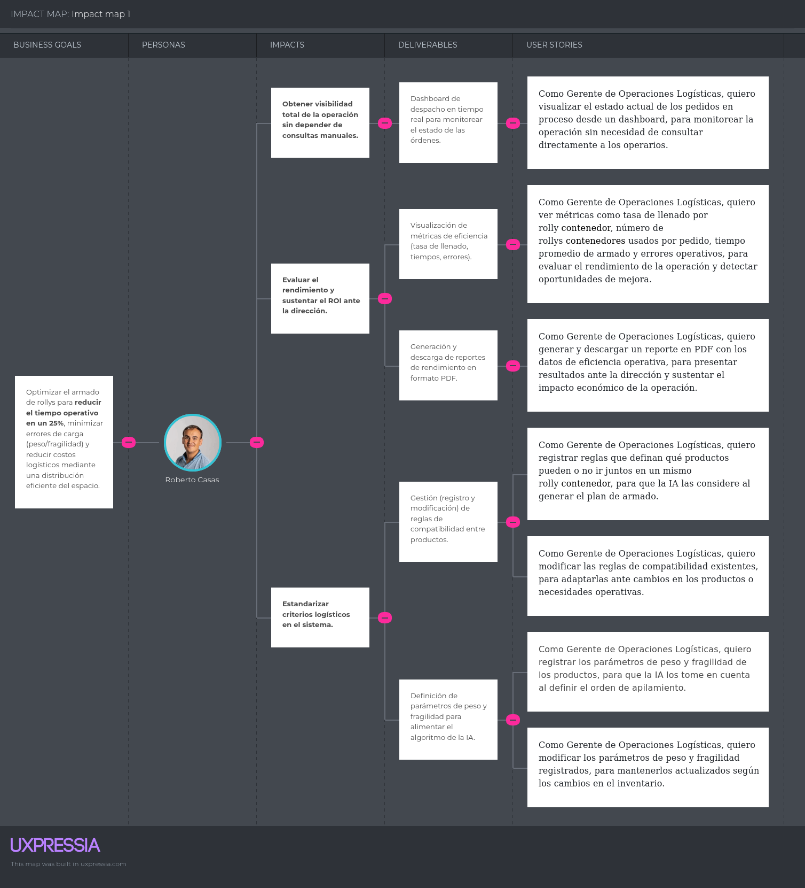

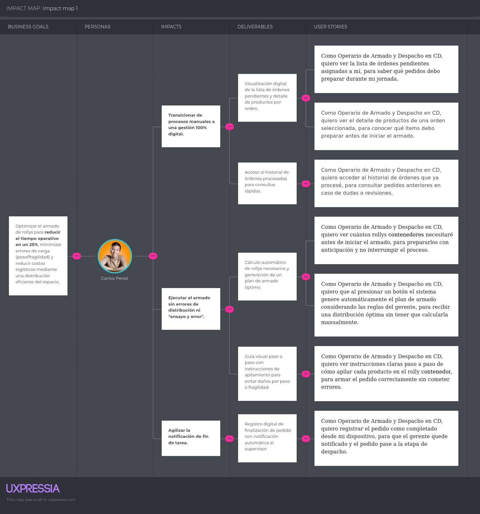

## 

## 3.4 Product Backlog

| **\# Orden** | **User Story ID** | **Título**                                             | **Descripción**                                                                                                                                                                                                                                      | **Story Points (1/2/3/5/8)** |
|--------------|-------------------|--------------------------------------------------------|------------------------------------------------------------------------------------------------------------------------------------------------------------------------------------------------------------------------------------------------------|------------------------------|
| 1            | US01              | Visualización de lista de órdenes pendientes           | Como Operario de Armado y Despacho en CD, quiero ver la lista de órdenes pendientes asignadas a mí, para saber qué pedidos debo preparar durante mi jornada.                                                                                         | 3                            |
| 2            | US02              | Visualización de detalle de una orden                  | Como Operario de Armado y Despacho en CD, quiero ver el detalle de productos de una orden seleccionada, para conocer qué ítems debo preparar antes de iniciar el armado.                                                                             | 2                            |
| 3            | US04              | Visualización de rollys necesarios para el pedido      | Como Operario de Armado y Despacho en CD, quiero ver cuántos rollys necesitaré antes de iniciar el armado, para prepararlos con anticipación y no interrumpir el proceso.                                                                            | 3                            |
| 4            | US05              | Generación de plan de armado por IA                    | Como Operario de Armado y Despacho en CD, quiero que al presionar un botón el sistema genere automáticamente el plan de armado considerando las reglas del gerente, para recibir una distribución óptima sin tener que calcularla manualmente.       | 8                            |
| 5            | US06              | Visualización de instrucciones de apilamiento por paso | Como Operario de Armado y Despacho en CD, quiero ver instrucciones claras paso a paso de cómo apilar cada producto en el rolly, para armar el pedido correctamente sin cometer errores.                                                              | 5                            |
| 6            | US07              | Finalización y registro de pedido armado               | Como Operario de Armado y Despacho en CD, quiero registrar el pedido como completado desde mi dispositivo, para que el gerente quede notificado y el pedido pase a la etapa de despacho.                                                             | 5                            |
| 7            | US11              | Registro de regla de compatibilidad entre productos    | Como Gerente de Operaciones Logísticas, quiero registrar reglas que definan qué productos pueden o no ir juntos en un mismo rolly, para que la IA las considere al generar el plan de armado.                                                        | 3                            |
| 8            | US12              | Modificación de regla de compatibilidad                | Como Gerente de Operaciones Logísticas, quiero modificar las reglas de compatibilidad existentes, para adaptarlas ante cambios en los productos o necesidades operativas.                                                                            | 2                            |
| 9            | US13              | Registro de parámetros de peso y fragilidad            | Como Gerente de Operaciones Logísticas, quiero registrar los parámetros de peso y fragilidad de los productos, para que la IA los tome en cuenta al definir el orden de apilamiento.                                                                 | 3                            |
| 10           | US14              | Modificación de parámetros de peso y fragilidad        | Como Gerente de Operaciones Logísticas, quiero modificar los parámetros de peso y fragilidad registrados, para mantenerlos actualizados según los cambios en el inventario.                                                                          | 2                            |
| 11           | US08              | Visualización de dashboard de despacho en tiempo real  | Como Gerente de Operaciones Logísticas, quiero visualizar el estado actual de los pedidos en proceso desde un dashboard, para monitorear la operación sin necesidad de consultar directamente a los operarios.                                       | 8                            |
| 12           | US09              | Visualización de métricas de eficiencia operativa      | Como Gerente de Operaciones Logísticas, quiero ver métricas como tasa de llenado por rolly, número de rollys usados, tiempo promedio de armado y errores operativos, para evaluar el rendimiento de la operación y detectar oportunidades de mejora. | 5                            |
| 13           | US10              | Descarga de reporte de rendimiento en PDF              | Como Gerente de Operaciones Logísticas, quiero generar y descargar un reporte en PDF con los datos de eficiencia operativa, para presentar resultados ante la dirección y sustentar el impacto económico de la operación.                            | 3                            |
| 14           | US03              | Historial de órdenes procesadas                        | Como Operario de Armado y Despacho en CD, quiero acceder al historial de órdenes que ya procesé, para consultar pedidos anteriores en caso de dudas o revisiones.                                                                                    | 3                            |

# Capítulo IV: Strategic-Level Software Design

## 4.1 Strategic-Level Attribute-Driven Design

## 4.1.1 Design Purpose

El propósito del diseño a nivel estratégico es definir una arquitectura de software que permita a RollySmart cumplir con sus objetivos principales de optimización logística, asegurando eficiencia operativa, escalabilidad y facilidad de uso en entornos de centros de distribución.

Este diseño busca transformar los requerimientos funcionales y atributos de calidad en decisiones arquitectónicas concretas que permitan:

- Automatizar el cálculo y distribución de productos en rollys contenedores

- Garantizar tiempos de respuesta rápidos en operaciones en tiempo real

- Soportar múltiples usuarios concurrentes en entornos logísticos

- Permitir una fácil integración y despliegue en diferentes empresas

## 4.1.2 Attribute-Driven Design Inputs

## 4.1.2.1 Primary Functionality (Primary User Stories)

En esta sección se presentan las User Stories que tienen mayor impacto en las decisiones arquitectónicas de RollySmart. Estas historias fueron seleccionadas debido a que involucran procesamiento intensivo, reglas de negocio críticas, interacción en tiempo real y necesidad de escalabilidad.

<table>
<colgroup>
<col style="width: 20%" />
<col style="width: 20%" />
<col style="width: 20%" />
<col style="width: 20%" />
<col style="width: 20%" />
</colgroup>
<thead>
<tr class="header">
<th><strong><mark>UserStory ID</mark></strong></th>
<th><strong><mark>Título</mark></strong></th>
<th><strong><mark>Descripción</mark></strong></th>
<th><strong><mark>Criterios de Aceptación</mark></strong></th>
<th><strong><mark>Relacionado con (Epic ID)</mark></strong></th>
</tr>
<tr class="odd">
<th>US05</th>
<th><table>
<colgroup>
<col style="width: 100%" />
</colgroup>
<thead>
<tr class="header">
<th>Generación de plan de armado</th>
</tr>
</thead>
<tbody>
</tbody>
</table>
<table>
<colgroup>
<col style="width: 100%" />
</colgroup>
<tbody>
</tbody>
</table></th>
<th>Como Operario, quiero que el sistema genere automáticamente el plan de armado considerando reglas logísticas, para optimizar la distribución sin cálculo manual.</th>
<th>
- El sistema genera un plan automáticamente al presionar un botón

- Se consideran peso, fragilidad y compatibilidad

- El resultado se obtiene en menos de 2 segundos
</th>
<th>E02</th>
</tr>
<tr class="header">
<th>US06</th>
<th><table>
<colgroup>
<col style="width: 100%" />
</colgroup>
<thead>
<tr class="header">
<th>Instrucciones de apilamiento</th>
</tr>
</thead>
<tbody>
</tbody>
</table></th>
<th><table>
<colgroup>
<col style="width: 100%" />
</colgroup>
<thead>
<tr class="header">
<th>Como Operario, quiero ver instrucciones paso a paso para armar el rolly correctamente.</th>
</tr>
</thead>
<tbody>
</tbody>
</table></th>
<th><table>
<colgroup>
<col style="width: 100%" />
</colgroup>
<thead>
<tr class="header">
<th>
- Se muestran instrucciones claras y ordenadas

- Cada paso indica ubicación del producto

- El operario puede seguir el flujo sin errores
</th>
</tr>
</thead>
<tbody>
</tbody>
</table></th>
<th>E02</th>
</tr>
<tr class="odd">
<th>US07</th>
<th>Finalización de armado</th>
<th>Como Operario, quiero registrar el pedido como completado para notificar al sistema.</th>
<th>
- El operario puede marcar como completado

- El estado se actualiza en tiempo real

- El supervisor puede visualizar el cambio
</th>
<th>E02</th>
</tr>
<tr class="header">
<th>US08</th>
<th>Dashboard en tiempo real</th>
<th>Como Gerente, quiero visualizar el estado de pedidos en tiempo real para monitorear la operación.</th>
<th>
- Los pedidos se actualizan automáticamente

- Se refleja el estado sin recargar

- Soporta múltiples usuarios concurrentes
</th>
<th>E03</th>
</tr>
<tr class="odd">
<th>US09</th>
<th>Métricas operativas</th>
<th>Como Gerente, quiero visualizar métricas para evaluar eficiencia logística.</th>
<th>
- Se calculan métricas automáticamente

- Se muestran indicadores clave (tiempo, uso de rollys)

- Datos actualizados constantemente
</th>
<th>E03</th>
</tr>
<tr class="header">
<th>US11</th>
<th>Registro de reglas de compatibilidad</th>
<th>Como Gerente, quiero definir qué productos pueden ir juntos para mejorar la distribución.</th>
<th>
- Se pueden crear reglas

- Las reglas son utilizadas por el motor de optimización

- Persistencia de reglas en base de datos
</th>
<th>E04</th>
</tr>
<tr class="odd">
<th>US12</th>
<th>Modificación de reglas</th>
<th>Como Gerente, quiero modificar reglas existentes para adaptarlas a cambios operativos.</th>
<th>
- Se pueden editar reglas sin afectar el sistema

- Los cambios se reflejan en nuevos cálculos

- No requiere reinicio del sistema
</th>
<th>E04</th>
</tr>
<tr class="header">
<th>US13</th>
<th>Registro de parámetros (peso/fragilidad)</th>
<th>Como Gerente, quiero definir peso y fragilidad para optimizar el apilamiento.</th>
<th>
- Se registran parámetros por producto

- Son utilizados en el cálculo automático

- Validación de datos ingresados
</th>
<th>E04</th>
</tr>
</thead>
<tbody>
</tbody>
</table>

## 4.1.2.2 Quality attribute Scenarios

En esta sección se definen los escenarios de atributos de calidad que influyen directamente en las decisiones arquitectónicas del sistema RollySmart. Estos escenarios describen situaciones específicas que el sistema debe soportar, considerando estímulo, respuesta esperada y métricas de evaluación.

| Atributo | Fuente                | Estímulo                     | Artefacto                                 | Entorno               | Respuesta                                                            | Medida                                     |
|----------|-----------------------|------------------------------|-------------------------------------------|-----------------------|----------------------------------------------------------------------|--------------------------------------------|
| QAS01    | Performance           | Operario                     | Solicita generar plan de armado (US05)    | Motor de optimización | El sistema calcula la distribución de productos y cantidad de rollys | Tiempo de respuesta ≤ 2 segundos           |
| QAS02    | Usabilidad            | Operario sin experiencia     | Usa el sistema por primera vez (US06)     | Interfaz de usuario   | El sistema muestra instrucciones claras y secuenciales               | ≥ 90% de tareas completadas sin asistencia |
| QAS03    | Escalabilidad         | Sistema                      | Incremento de usuarios simultáneos (US08) | Backend / API         | El sistema mantiene tiempos de respuesta estables                    | Soporta ≥ 100 usuarios concurrentes        |
| QAS04    | Disponibilidad        | Operación logística          | Uso continuo durante jornada laboral      | Sistema completo      | El sistema permanece operativo sin interrupciones                    | Disponibilidad ≥ 99%                       |
| QAS05    | Modificabilidad       | Administrador                | Cambia reglas de compatibilidad (US12)    | Motor de reglas       | El sistema aplica cambios sin afectar otros módulos                  | Cambios reflejados sin downtime            |
| QAS06    | Consistencia de datos | Sistema                      | Actualización de estado de pedido (US07)  | Base de datos         | El estado se refleja correctamente en todos los módulos              | Latencia de sincronización ≤ 1 segundo     |
| QAS07    | Interoperabilidad     | Sistema externo (ERP futuro) | Solicita integración de pedidos           | API                   | El sistema expone servicios compatibles                              | API REST con estándares JSON               |
| QAS08    | Seguridad             | Usuario                      | Accede al sistema                         | Backend               | El sistema valida identidad y permisos                               | Acceso restringido por roles               |
| QAS09    | Fiabilidad            | Operario                     | Error en cálculo o fallo del sistema      | Motor de optimización | El sistema maneja errores y mantiene integridad                      | Tasa de fallos \< 1%                       |

## 4.1.2.3 Constraints

<table>
<colgroup>
<col style="width: 20%" />
<col style="width: 20%" />
<col style="width: 20%" />
<col style="width: 20%" />
<col style="width: 20%" />
</colgroup>
<thead>
<tr class="header">
<th>Technical Story ID</th>
<th>Título</th>
<th>Descripción</th>
<th>Criterios de Aceptación</th>
<th>Relacionado con (Epic ID)</th>
</tr>
<tr class="odd">
<th>TS01</th>
<th>Soporte multi-dispositivo</th>
<th>El sistema debe funcionar en dispositivos móviles, tablets y computadoras dentro del centro de distribución.</th>
<th>
- Interfaz adaptable (responsive o app)

- Funciona en Android y navegadores web

- No pierde funcionalidad entre dispositivos
</th>
<th>E01, E02</th>
</tr>
<tr class="header">
<th>TS02</th>
<th>Conectividad limitada</th>
<th>El sistema debe operar en entornos con red local o conectividad intermitente.</th>
<th>
- Funciona en red interna

- Manejo de reconexión automática

- No pérdida de datos ante desconexión temporal
</th>
<th>E02</th>
</tr>
<tr class="odd">
<th>TS03</th>
<th>Tiempo de respuesta crítico</th>
<th>El sistema debe responder rápidamente para no afectar la operación logística.</th>
<th>
- Generación de plan &lt; 2 segundos

- Interacciones sin bloqueos visibles
</th>
<th>E02</th>
</tr>
<tr class="header">
<th>TS04</th>
<th>Integración futura con ERP</th>
<th>El sistema debe permitir integración con sistemas externos empresariales.</th>
<th>
- Exposición de API REST

- Uso de formatos estándar (JSON)

- Documentación de endpoints
</th>
<th>E03</th>
</tr>
<tr class="odd">
<th>TS05</th>
<th>Bajo nivel técnico del usuario</th>
<th>La solución debe ser usable por operarios sin conocimientos técnicos.</th>
<th>
- Interfaz simple

- Flujo guiado paso a paso

- No requiere capacitación extensa
</th>
<th>E02</th>
</tr>
<tr class="header">
<th>TS06</th>
<th>Reglas logísticas dinámicas</th>
<th>El sistema debe permitir cambios en reglas sin afectar su funcionamiento.</th>
<th>
-Reglas configurables desde UI

- Cambios aplicados sin reinicio

- Persistencia de reglas
</th>
<th>E04</th>
</tr>
<tr class="odd">
<th>TS07</th>
<th>Escalabilidad SaaS</th>
<th>El sistema debe soportar múltiples empresas bajo modelo SaaS.</th>
<th>
- Soporte multi-tenant

- Aislamiento de datos por cliente

- Escalabilidad horizontal
</th>
<th>E03</th>
</tr>
<tr class="header">
<th>TS08</th>
<th>Persistencia de datos</th>
<th>El sistema debe almacenar pedidos, configuraciones y resultados.</th>
<th>
- Base de datos centralizada

- Integridad de datos garantizada

- Historial disponible
</th>
<th>E01</th>
</tr>
<tr class="odd">
<th>TS09</th>
<th>Compatibilidad con dispositivos industriales</th>
<th>El sistema debe poder integrarse con dispositivos como escáneres Zebra.</th>
<th>
- Soporte de lectura de códigos

- Integración con SDK (si aplica)

- Funcionamiento híbrido (cámara + hardware)
</th>
<th>E2</th>
</tr>
</thead>
<tbody>
</tbody>
</table>

## 4.1.3 Architectural Drivers Backlog

| Driver ID | Título de Driver                             | Descripción                                                                                                                                      | Importancia para Stakeholders (High, Medium, Low) | Impacto en Architecture Technical Complexity (High, Medium, Low) |
|-----------|----------------------------------------------|--------------------------------------------------------------------------------------------------------------------------------------------------|---------------------------------------------------|------------------------------------------------------------------|
| AD01      | Generación automática de plan de armado      | El sistema debe calcular la distribución óptima de productos considerando múltiples restricciones logísticas (peso, fragilidad, compatibilidad). | High                                              | High                                                             |
| AD02      | Tiempo de respuesta en cálculo               | El sistema debe generar resultados en tiempo real sin afectar la operación logística.                                                            | High                                              | High                                                             |
| AD03      | Motor de reglas dinámico                     | El sistema debe permitir configurar y modificar reglas logísticas sin afectar otros componentes.                                                 | High                                              | High                                                             |
| AD04      | Visualización guiada de armado               | El sistema debe proporcionar instrucciones claras paso a paso para operarios.                                                                    | High                                              | Medium                                                           |
| AD05      | Actualización en tiempo real                 | El sistema debe reflejar cambios de estado de pedidos en tiempo real para supervisión.                                                           | High                                              | High                                                             |
| AD06      | Escalabilidad multiusuario                   | El sistema debe soportar múltiples operarios y supervisores concurrentes.                                                                        | High                                              | High                                                             |
| AD07      | Arquitectura multi-tenant (SaaS)             | El sistema debe soportar múltiples empresas con aislamiento de datos.                                                                            | High                                              | High                                                             |
| AD08      | Integración con sistemas externos            | El sistema debe integrarse con ERP u otros sistemas mediante APIs.                                                                               | Medium                                            | Medium                                                           |
| AD09      | Usabilidad para operarios                    | El sistema debe ser intuitivo y usable por usuarios sin conocimientos técnicos.                                                                  | High                                              | Medium                                                           |
| AD10      | Tolerancia a conectividad limitada           | El sistema debe operar en entornos con red inestable o local.                                                                                    | Medium                                            | High                                                             |
| AD11      | Persistencia y consistencia de datos         | El sistema debe garantizar integridad y disponibilidad de la información.                                                                        | High                                              | Medium                                                           |
| AD12      | Compatibilidad con dispositivos industriales | El sistema debe funcionar con escáneres Zebra u otros dispositivos.                                                                              | Medium                                            | Medium                                                           |

## 4.1.4 Architectural Design Decisions

Se priorizaron los drivers con mayor impacto en el negocio y mayor complejidad técnica, tales como la generación automática del plan de armado, el rendimiento en tiempo real y la modificabilidad de reglas logísticas.

Motor de Optimización (AD01, AD02, AD03)

**Drivers considerados:**

- AD01: Generación automática de plan de armado

- AD02: Tiempo de respuesta en cálculo

- AD03: Motor de reglas dinámico

### Candidate Pattern Evaluation Matrix

<table>
<colgroup>
<col style="width: 12%" />
<col style="width: 12%" />
<col style="width: 12%" />
<col style="width: 12%" />
<col style="width: 12%" />
<col style="width: 12%" />
<col style="width: 12%" />
<col style="width: 12%" />
</colgroup>
<thead>
<tr class="header">
<th><strong>Driver ID</strong></th>
<th><strong>Título de Driver</strong></th>
<th colspan="2"><strong>Pattern 1: Monolito</strong></th>
<th colspan="2"><strong>Pattern 2: Microservicios</strong></th>
<th colspan="2"><strong>Pattern 3: Servicio desacoplado (Motor independiente)</strong></th>
</tr>
<tr class="odd">
<th></th>
<th></th>
<th>Pro</th>
<th>Con</th>
<th>Pro</th>
<th>Con</th>
<th>Pro</th>
<th>Con</th>
</tr>
<tr class="header">
<th>AD01</th>
<th>Motor de optimización</th>
<th>Simplicidad inicial</th>
<th>Difícil escalar</th>
<th>Escalable</th>
<th>
Complejidad alta

<table>
<colgroup>
<col style="width: 100%" />
</colgroup>
<tbody>
</tbody>
</table></th>
<th>Permite aislar el motor</th>
<th>Requiere comunicación</th>
</tr>
<tr class="odd">
<th>AD02</th>
<th>Performance</th>
<th>Baja latencia local</th>
<th>Se degrada con carga</th>
<th>Escala mejor</th>
<th>Overhead de red</th>
<th>Optimización dedicada</th>
<th>Latencia controlada</th>
</tr>
<tr class="header">
<th>AD03</th>
<th>Reglas dinámicas</th>
<th>Fácil implementación</th>
<th>Alto acoplamiento</th>
<th>Modular</th>
<th>Complejo de gestionar</th>
<th>Bajo acoplamiento</th>
<th>Mayor diseño inicial</th>
</tr>
</thead>
<tbody>
</tbody>
</table>

## 4.1.5 Quality Attribute Scenario Refinements

**Scenario Refinement for Scenario 1**

| **Scenario(s)**                 | Como Operario de Armado y Despacho en CD, quiero presionar el botón "Generar armado" y recibir el plan de distribución de productos de forma inmediata, para no interrumpir el ritmo de la operación logística.                   |
|---------------------------------|-----------------------------------------------------------------------------------------------------------------------------------------------------------------------------------------------------------------------------------|
| **Business Goals**              | Reducir el tiempo de preparación de pedidos eliminando el cálculo manual, garantizando que la IA responda sin afectar la continuidad operativa del centro de distribución.                                                        |
| **Relevant Quality Attributes** | Rendimiento y Disponibilidad                                                                                                                                                                                                      |
| **Stimulus**                    | El operario presiona el botón "Generar armado" con una orden cargada.                                                                                                                                                             |
| **Stimulus Source**             | Operario autenticado en Power Apps desde su tablet o dispositivo móvil.                                                                                                                                                           |
| **Environment**                 | Jornada operativa activa, múltiples operarios procesando pedidos simultáneamente, red local disponible.                                                                                                                           |
| **Artifact**                    | Rolly Planning Service + OpenAI API + Rules Service                                                                                                                                                                               |
| **Response**                    | El sistema consulta las reglas vigentes, envía el contexto a OpenAI y devuelve el plan de armado al operario con instrucciones paso a paso.                                                                                       |
| **Response Measure**            | El plan de armado se genera y muestra en menos de 2 segundos tras presionar el botón, sin bloqueos visibles en la interfaz.                                                                                                       |
| **Questions & Issues**          | ¿Qué sucede si OpenAI API no responde en el tiempo esperado? ¿Existe un mecanismo de fallback para generar un plan básico sin depender de la IA? ¿Cómo se comporta el sistema si varios operarios generan planes simultáneamente? |

**Scenario Refinement for Scenario 2**

| **Scenario(s)**                 | Como Gerente de Operaciones Logísticas, quiero modificar una regla de compatibilidad entre productos desde el dashboard, para que la IA la aplique inmediatamente en los siguientes planes de armado sin interrumpir la operación activa. |
|---------------------------------|-------------------------------------------------------------------------------------------------------------------------------------------------------------------------------------------------------------------------------------------|
| **Business Goals**              | Permitir que el negocio adapte las reglas logísticas de forma dinámica ante cambios en el inventario o nuevas políticas operativas, sin necesidad de intervención técnica ni reinicios del sistema.                                       |
| **Relevant Quality Attributes** | Modificabilidad y Disponibilidad                                                                                                                                                                                                          |
| **Stimulus**                    | El gerente edita y guarda una regla de compatibilidad desde la interfaz de configuración.                                                                                                                                                 |
| **Stimulus Source**             | Gerente autenticado en el dashboard de RollySmart.                                                                                                                                                                                        |
| **Environment**                 | Sistema en operación activa con pedidos siendo procesados en simultáneo.                                                                                                                                                                  |
| **Artifact**                    | Rules Service + Rolly Planning Service                                                                                                                                                                                                    |
| **Response**                    | El sistema persiste la nueva regla y el motor de planificación la considera a partir del siguiente plan generado, sin afectar los planes ya en ejecución.                                                                                 |
| **Response Measure**            | El cambio queda aplicado en menos de 3 segundos y los planes generados posterior a la modificación reflejan la nueva regla correctamente.                                                                                                 |
| **Questions & Issues**          | ¿Cómo se evita que una regla mal configurada genere planes inválidos? ¿Existe validación previa antes de persistir el cambio? ¿Se registra un historial de cambios en las reglas para auditoría?                                          |

**Scenario Refinement for Scenario 3**

|                             |                                                                                                                                                                                                                            |
|-----------------------------|----------------------------------------------------------------------------------------------------------------------------------------------------------------------------------------------------------------------------|
| Scenario(s)                 | Como Operario de Armado y Despacho en CD, quiero que el sistema me guíe paso a paso con instrucciones claras y simples, para completar el armado correctamente sin necesitar capacitación extensa ni asistencia adicional. |
| Business Goals              | Reducir la curva de aprendizaje del sistema y minimizar errores operativos, logrando que cualquier operario pueda usar RollySmart desde el primer día sin depender de experiencia previa en herramientas digitales.        |
| Relevant Quality Attributes | Usabilidad y Confiabilidad                                                                                                                                                                                                 |
| Stimulus                    | El operario inicia el proceso de armado y sigue las instrucciones mostradas en pantalla.                                                                                                                                   |
| Stimulus Source             | Operario sin experiencia previa en herramientas digitales, usando una tablet en el piso del almacén.                                                                                                                       |
| Environment                 | Ambiente ruidoso y de alta actividad, dispositivo móvil o tablet con pantalla de tamaño estándar.                                                                                                                          |
| Artifact                    | Power Apps (interfaz de operario) + Execution Service                                                                                                                                                                      |
| Response                    | El sistema muestra una instrucción a la vez con lenguaje simple, indicando qué producto colocar, en qué posición y avanzando al siguiente paso tras la confirmación del operario.                                          |
| Response Measure            | El operario completa el armado correctamente sin asistencia adicional en al menos el 90% de los casos durante las primeras sesiones de uso.                                                                                |
| Questions & Issues          | ¿Qué ocurre si el operario se equivoca en un paso y necesita retroceder? ¿El sistema permite corregir sin reiniciar todo el proceso? ¿Cómo se adapta la interfaz a operarios con bajo nivel de lectura?                    |

## 4.2 Strategic-Level Domain-Driven Design

## 4.2.1 EventStorming

### Unstructured Exploration 

Es la fase de lluvia de ideas. Todos los participantes escriben **Eventos de Dominio** en post-its de color **naranja** y los pegan en la pared.

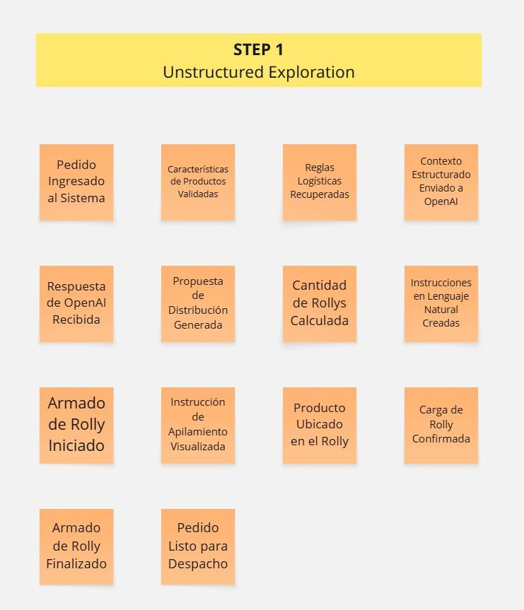

### Timelines (Línea de tiempo)

Se toma el caos del paso anterior y se ordena estrictamente de **izquierda a derecha en orden cronológico**.

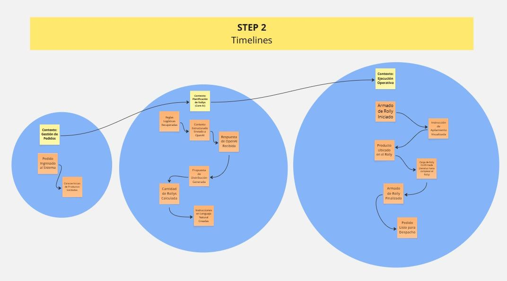

### Pain Points (Puntos de dolor)

Se utilizan post-its para marcar los cuellos de botella, problemas, ineficiencias o quejas de los usuarios en el proceso actual.

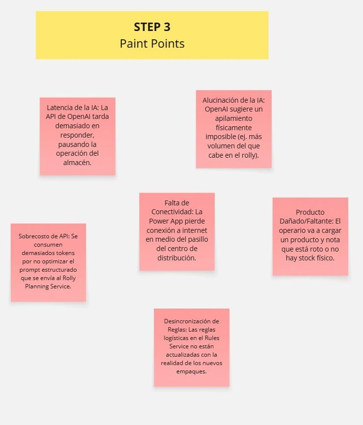

**Pivotal Points:** Son los hitos cruciales o eventos más importantes que cambian drásticamente el estado del negocio y marcan el final de una fase y el inicio de otra

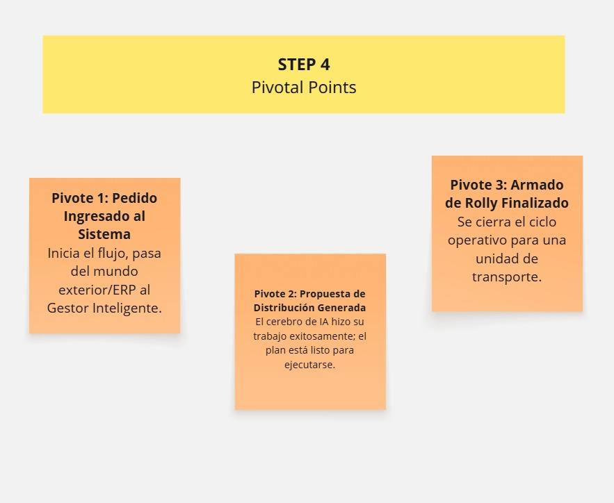

**Commands (Comandos):** Son la acción o intención que un usuario o el sistema ejecuta para que ocurra un evento

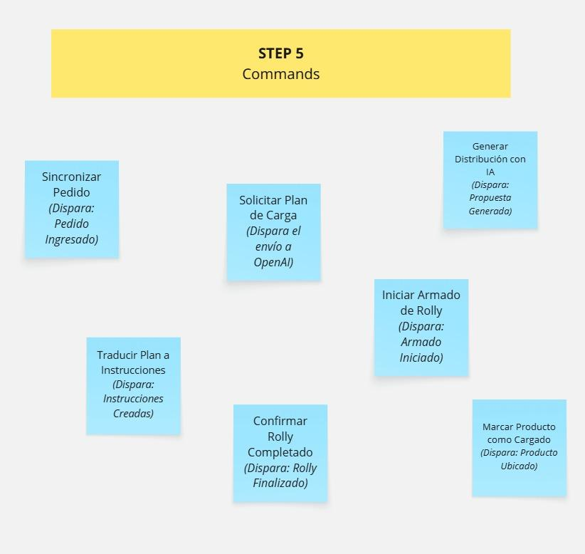

**Policies (Políticas o Reglas de Negocio):**

Son las reglas reactivas o automatizaciones que dicen: *"Siempre que ocurra el \[Evento A\], el sistema debe reaccionar ejecutando el \[Comando B\]"*.

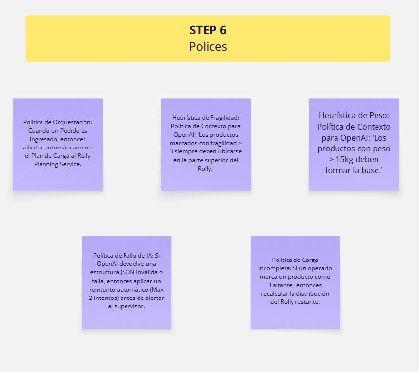

**Read Models (Modelos de Lectura):** Es la información exacta (datos, dashboard, reporte, pantalla) que un actor necesita ver para poder ejecutar un Comando.

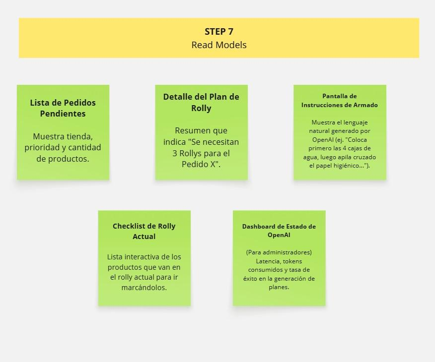

**External Systems (Sistemas Externos):** Representan cualquier software, API de terceros o sistema heredado del cual dependemos o al cual debemos enviarle datos

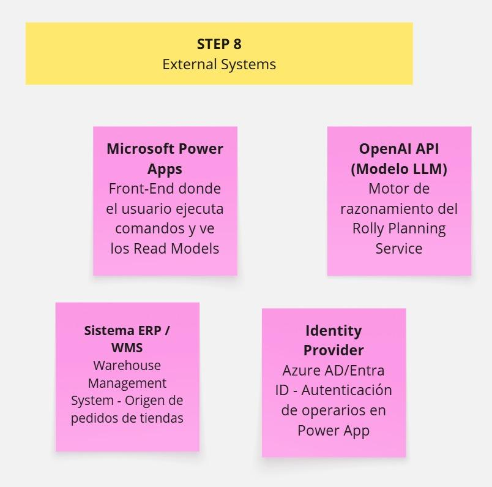

**Aggregates (Agregados)**

Un Agregado es un clúster o grupo de Entidades y datos que cambian juntos y garantizan la consistencia transaccional.

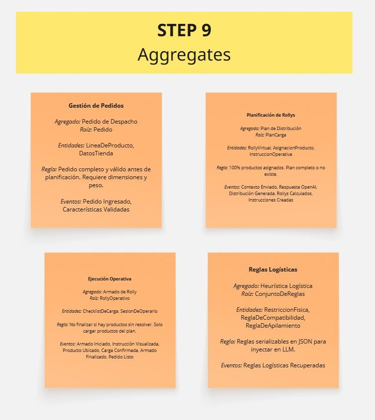

## 4.2.2 Candidate Context Discovery

Agruparnos para descubrir los **Contextos Candidatos**. Esto ayuda a visualizar las fronteras de los futuros microservicios que obtendrá nuestro proyecto.

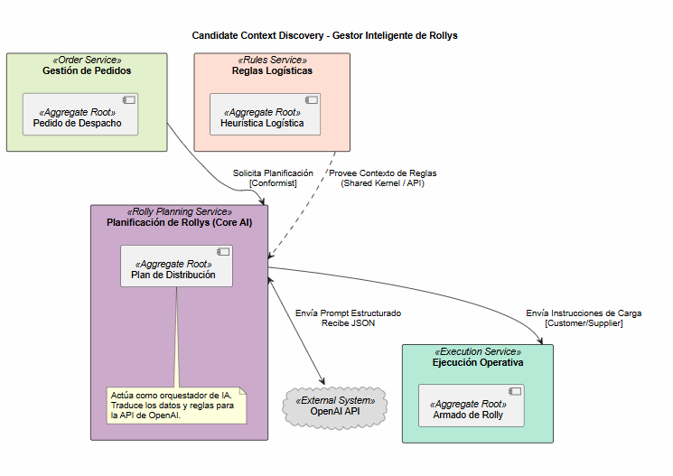

## 4.2.3 Domain Message Flows Modeling

Aquí mostramos cómo interactúan los Bounded Contexts a través del tiempo mediante el paso de **Comandos**, **Eventos** y **Consultas**.

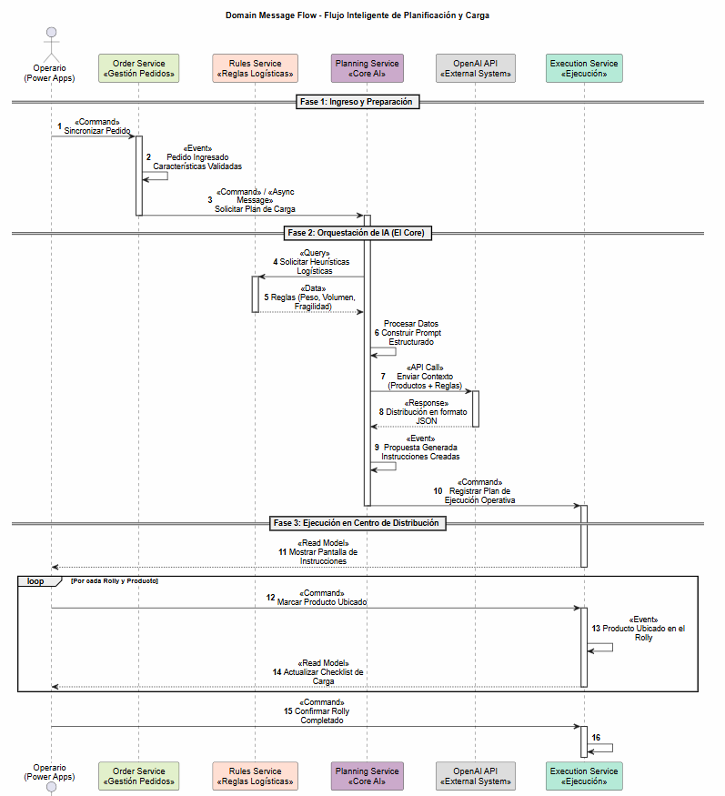

## 4.2.4 Bounded Context Canvases

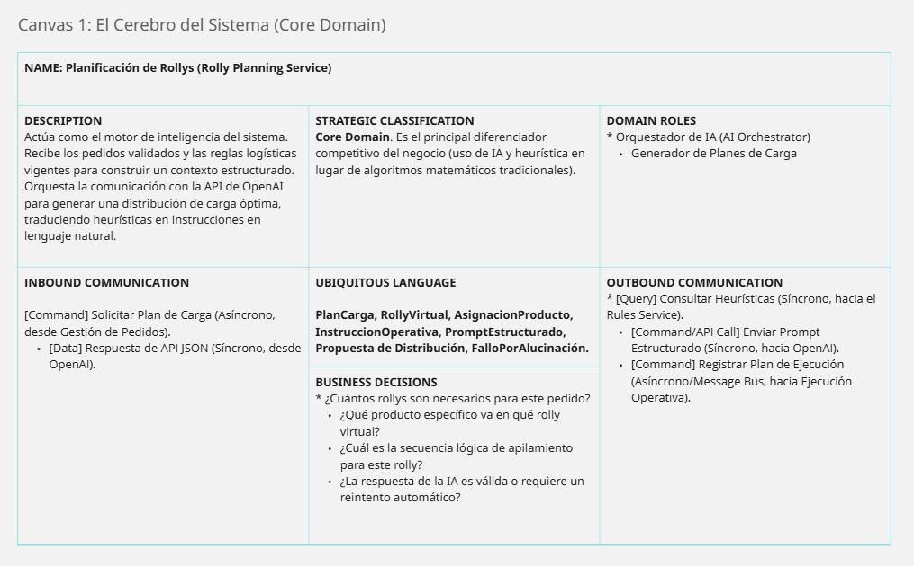

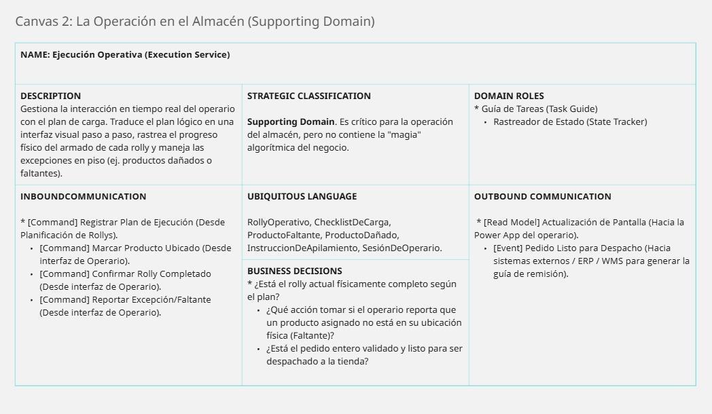

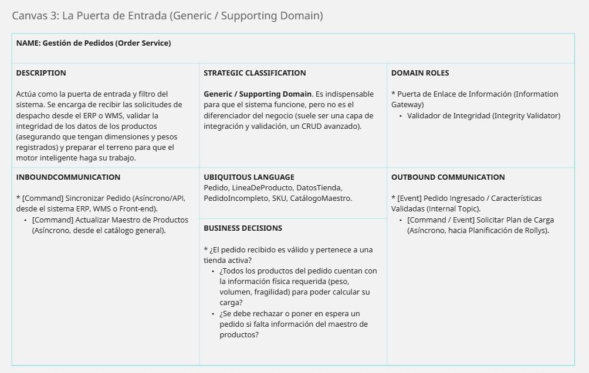

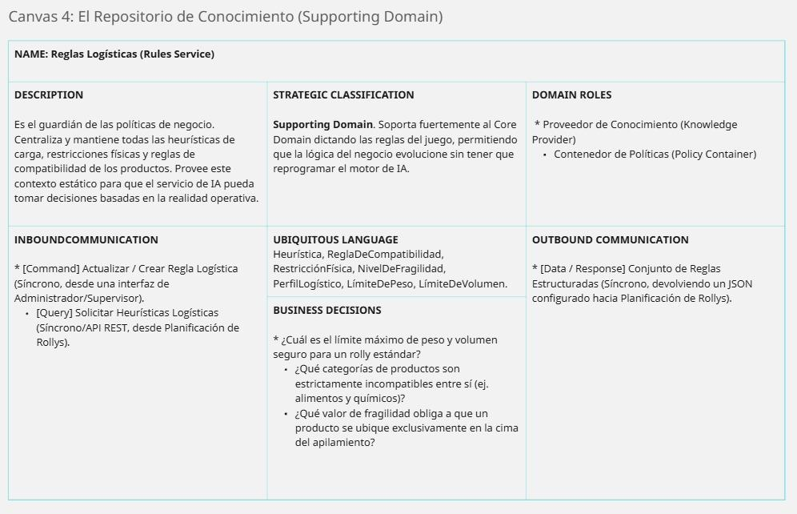

## 4.2.5 Context Mapping

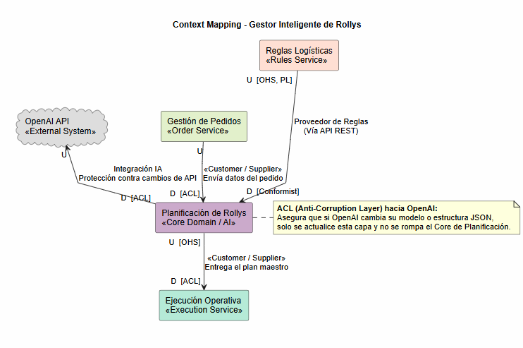

## 4.3 Software Architecture

RollySmart es una solución tecnológica de gestión inteligente de armado de rollys para centros de distribución, diseñada para optimizar el proceso de preparación y despacho de pedidos hacia tiendas mediante automatización asistida por inteligencia artificial. La plataforma busca eliminar la dependencia del criterio manual del operario, reducir errores operativos y maximizar el aprovechamiento volumétrico de cada rolly.

La arquitectura de software de RollySmart está compuesta por múltiples servicios y sistemas que interactúan para brindar funcionalidad en tiempo real a sus dos actores principales: el Operario de Almacén y el Administrador/Supervisor. Su diseño sigue principios de modularidad, separación de responsabilidades por Bounded Contexts y orquestación inteligente, permitiendo:

- Recepción y validación de pedidos provenientes del sistema ERP/WMS corporativo.

- Generación automática de planes de carga optimizados mediante un modelo de lenguaje (OpenAI API).

- Aplicación de reglas heurísticas, restricciones de fragilidad y compatibilidad configuradas por el supervisor.

- Guía visual paso a paso al operario a través de Microsoft Power Apps en dispositivos móviles de piso.

- Seguimiento del estado de ejecución en tiempo real con confirmación de rollys completados.

- Notificación automática al ERP/WMS al cierre del pedido listo para despacho.

## 4.3.1 Software Architecture System Landscape Diagram

Este diagrama presenta la vista empresarial más amplia del sistema, mostrando a todos los actores, sistemas externos y el Rolly Management System como una unidad. Se eligió este nivel porque permite identificar de forma clara quiénes interactúan con el ecosistema completo y qué rol cumple cada sistema externo sin entrar en detalles internos.

Se identificaron dos actores humanos:

- **El Operario de Almacén**, que interactúa exclusivamente a través de Power Apps, y el Supervisor, que administra reglas directamente sobre el Rules Service.

- **Como sistemas externos** se incluyen el ERP/WMS (fuente de pedidos), OpenAI API (motor de razonamiento), Azure AD/Entra ID (autenticación) y Microsoft Power Apps (frontend de piso).

Esta separación permite visualizar claramente las fronteras del sistema y las dependencias externas antes de profundizar en niveles de detalle.

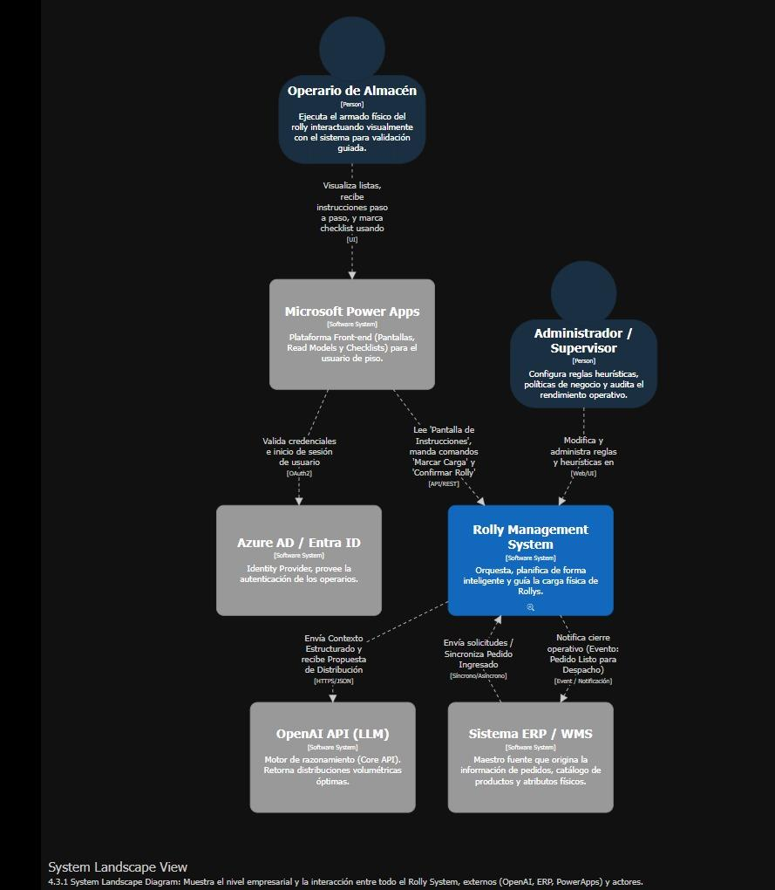

## 4.3.2 Software Architecture Context Level Diagrams

Este diagrama enfoca la perspectiva directamente sobre el Rolly Management System, mostrando qué entra y qué sale del sistema sin revelar su estructura interna. Se eligió este nivel para comunicar de forma ejecutiva el propósito del sistema y sus integraciones principales.

El sistema recibe pedidos desde el ERP/WMS, delega la autenticación a Azure AD, expone su funcionalidad operativa a través de Power Apps y utiliza OpenAI API como motor de optimización. Este diagrama justifica la necesidad del sistema como capa de orquestación central entre el mundo operativo (operario en piso) y el mundo de datos (ERP y AI), evidenciando que sin este intermediario las decisiones de carga seguirán siendo manuales y propensas a error.

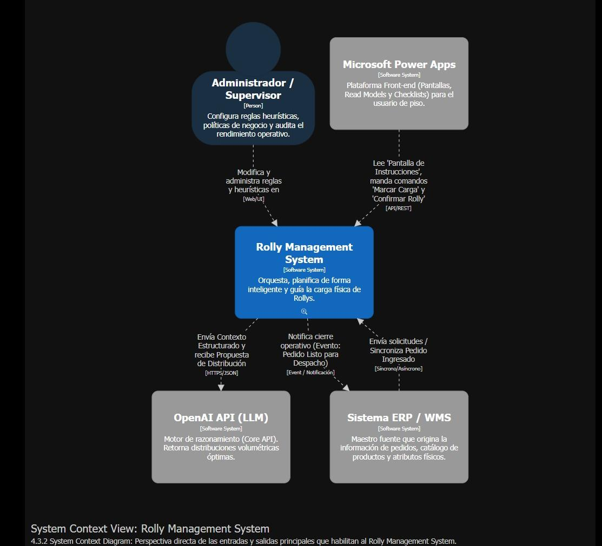

## 4.3.3 Software Architecture Container Level Diagrams

Este diagrama descompone el Rolly Management System en sus cuatro contenedores internos, cada uno representando un Bounded Context independiente. Se eligió esta granularidad para mostrar cómo fluye la información desde la recepción del pedido hasta la ejecución física del armado.

- **Order Service** actúa como punto de entrada, validando la integridad de los datos del ERP antes de disparar el proceso de planificación.

- **Rules Service** centraliza las heurísticas y restricciones configuradas por el supervisor, desacoplando la lógica de negocio del motor de IA.

- **Rolly Planning Service** es el núcleo del sistema: orquesta el contexto hacia OpenAI y traduce la respuesta a instrucciones operativas concretas.

- **Execution Service** gestiona el estado en tiempo real del armado, recibe confirmaciones desde Power Apps y notifica al ERP al cierre del pedido.

Esta separación por Bounded Contexts permite que cada servicio evolucione, escale y se mantenga de forma independiente, reduciendo el acoplamiento y facilitando futuras iteraciones del producto.

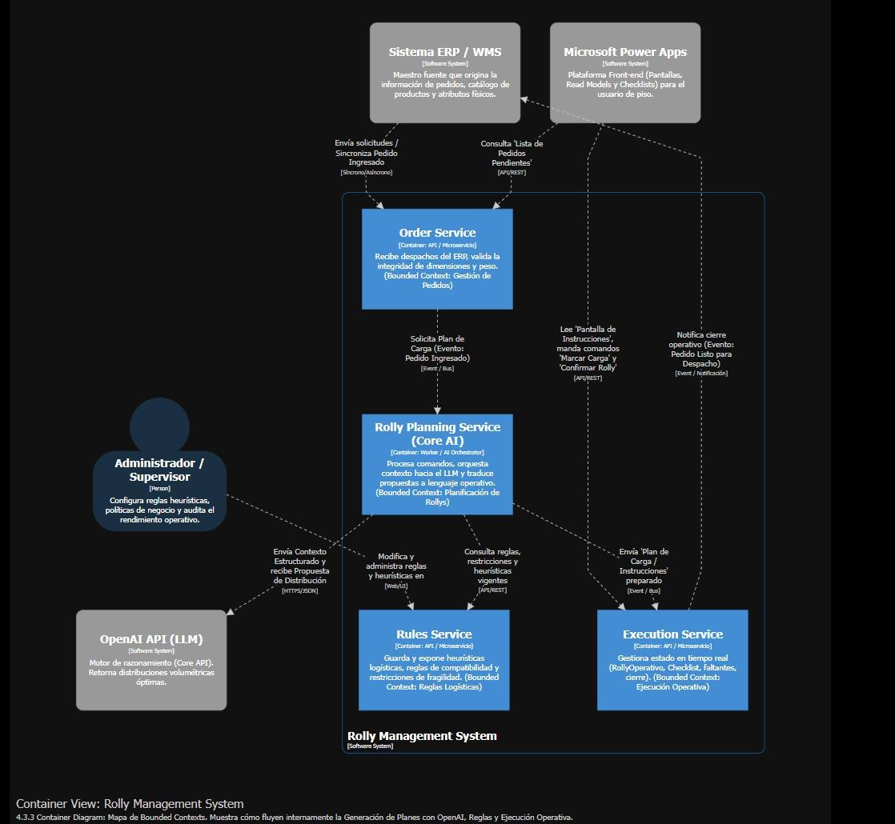

## 4.3.4 Software Architecture Deployment Diagrams

Este diagrama muestra la topología de despliegue del sistema en producción, dividida en tres nodos principales. Se eligió esta arquitectura para balancear accesibilidad operativa, escalabilidad y dependencia de terceros.

- **Piso de Operaciones**: los operarios acceden al sistema desde dispositivos móviles o handhelds que ejecutan Power Apps, manteniendo la interfaz en el edge cercano al usuario sin requerir infraestructura propia en el almacén.

- **Entorno Cloud (Azure)**: los cuatro microservicios del Rolly Management System se despliegan en un clúster Kubernetes (PaaS), lo que garantiza alta disponibilidad, escalabilidad horizontal y gestión centralizada del ciclo de vida de los servicios.

- **Third Party Cloud**: OpenAI API, Azure AD y el ERP residen en infraestructura de terceros, lo cual externaliza la complejidad de autenticación, razonamiento AI y gestión de datos maestros, permitiendo que el equipo de Loadify Solutions se concentre en la lógica de negocio propia.

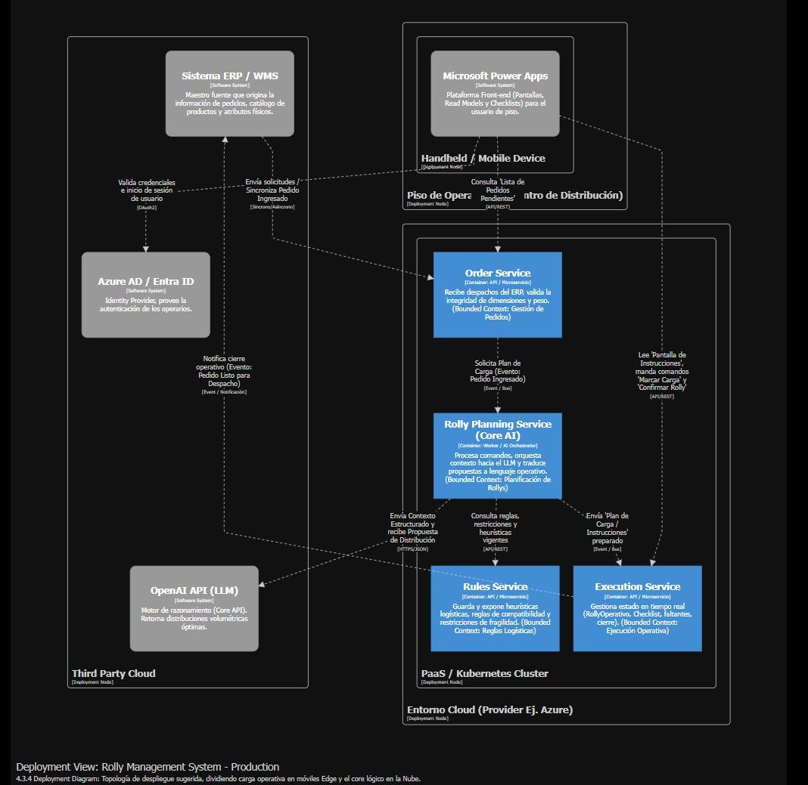

# Conclusiones

## Conclusiones y recomendaciones

- La metodología Lean UX permitió al equipo centrarse en problemas reales del operario y del gerente antes de diseñar cualquier pantalla, lo que redujo el riesgo de construir funcionalidades innecesarias y aseguró que cada decisión de diseño tuviera respaldo en los escenarios documentados. Se recomienda continuar aplicando este enfoque iterativo en futuras versiones del producto, validando cada nueva funcionalidad con usuarios reales antes de desarrollarla.

- RollySmart demuestra que es posible digitalizar un proceso logístico manual mediante herramientas low-code sin necesidad de infraestructura tecnológica compleja, lo que lo hace accesible para empresas medianas del sector retail en Perú. Se recomienda aprovechar esta ventaja para hacer demostraciones tempranas con centros de distribución reales, ya que el feedback operativo en contexto real será más valioso que cualquier supuesto documentado.

- El valor del sistema está directamente ligado a la calidad de los datos que el gerente configure y a la adopción del operario en piso. Sin ambos factores alineados, la inteligencia artificial no podrá generar recomendaciones útiles. Se recomienda que cualquier plan de implementación contempla una etapa de onboarding tanto para el gerente como para el operario antes de poner el sistema en producción.

# Referencias Bibliográficas

Gothelf, J., & Seiden, J. (2021). *Lean UX: Designing Great Products with Agile Teams* (3rd ed.). O'Reilly Media. [<u>oreilly/library/lean-ux-3rd</u>](https://www.oreilly.com/library/view/lean-ux-3rd/9781098116293/)

Microsoft. (2024). *What is Power Apps? — Power Apps*. Microsoft Learn. [<u>learn.microsoft.com/power-apps</u>](https://learn.microsoft.com/en-us/power-apps/powerapps-overview)

OpenAI. (2024). *Developer Quickstart — OpenAI API Documentation*. OpenAI Platform. [<u>platform.openai.com/docs/quickstart</u>](https://platform.openai.com/docs/quickstart)

# Anexos

## Videos de Exposición

- TB1: [<u>TB1 EXPOSICION</u>](https://upcedupe-my.sharepoint.com/:v:/g/personal/u202218899_upc_edu_pe/IQAXrLcg7UimRaa4kweM8QIAAacQ21AmRLuQuJeWrADySYA?nav=eyJyZWZlcnJhbEluZm8iOnsicmVmZXJyYWxBcHAiOiJPbmVEcml2ZUZvckJ1c2luZXNzIiwicmVmZXJyYWxBcHBQbGF0Zm9ybSI6IldlYiIsInJlZmVycmFsTW9kZSI6InZpZXciLCJyZWZlcnJhbFZpZXciOiJNeUZpbGVzTGlua0NvcHkifX0&e=wFzVDH)
